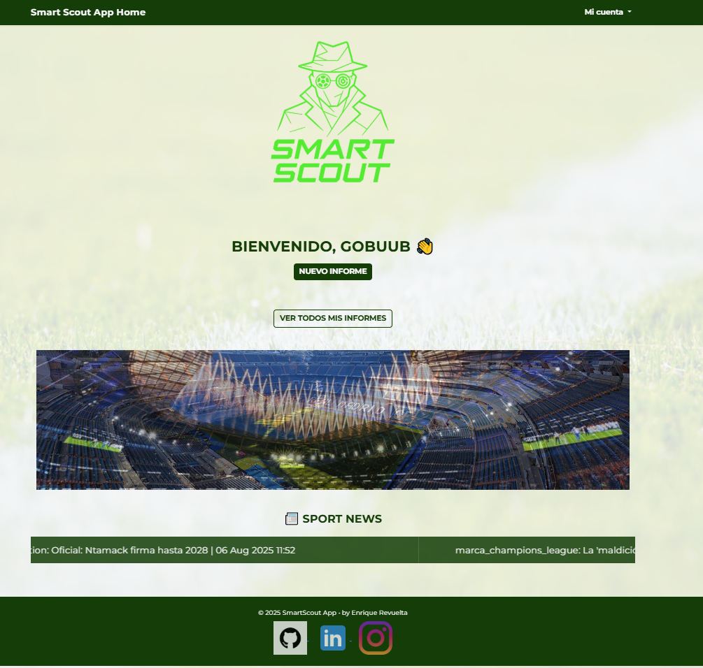
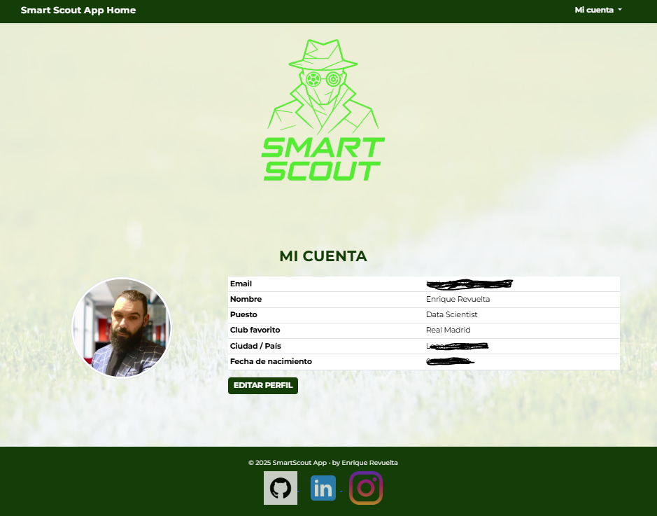
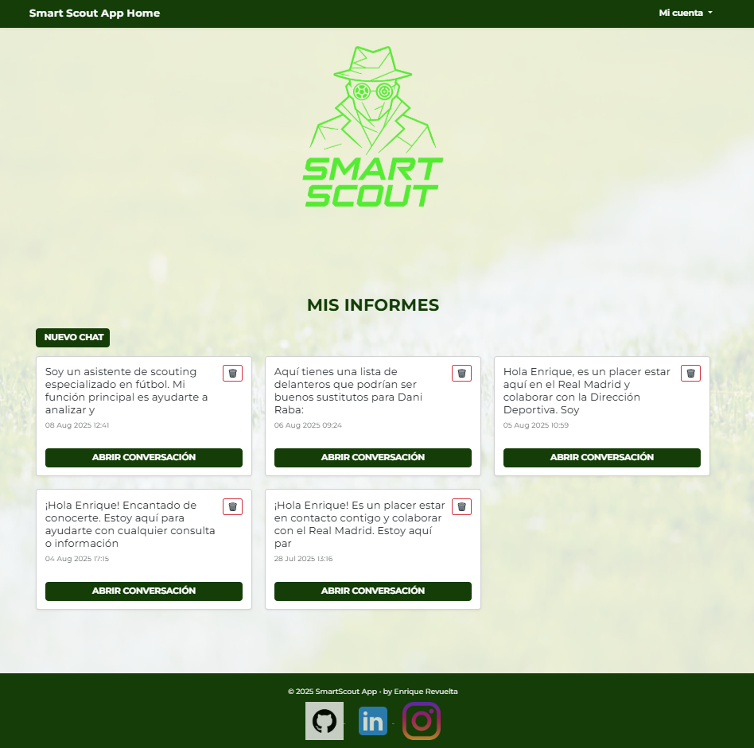
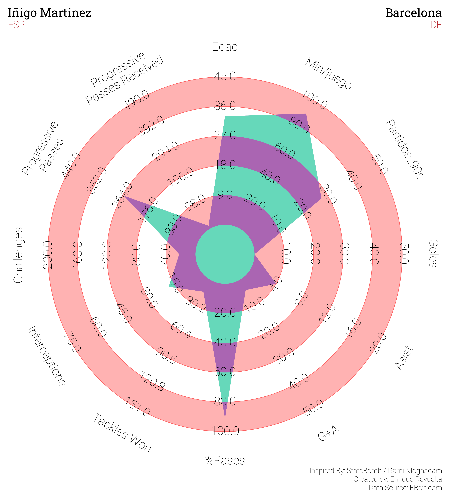
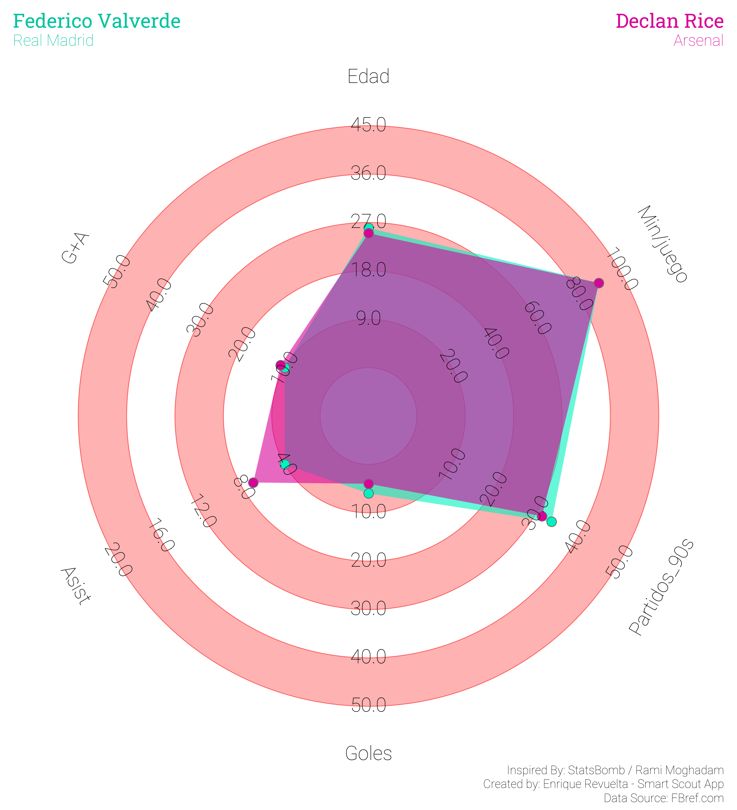
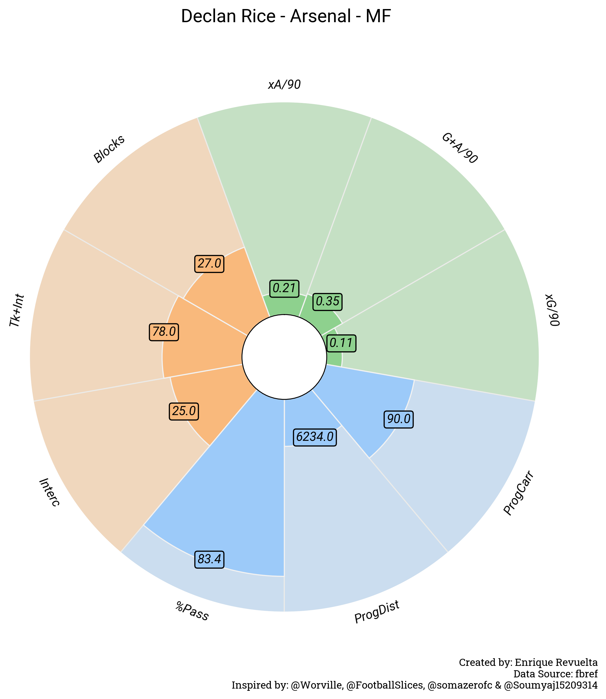
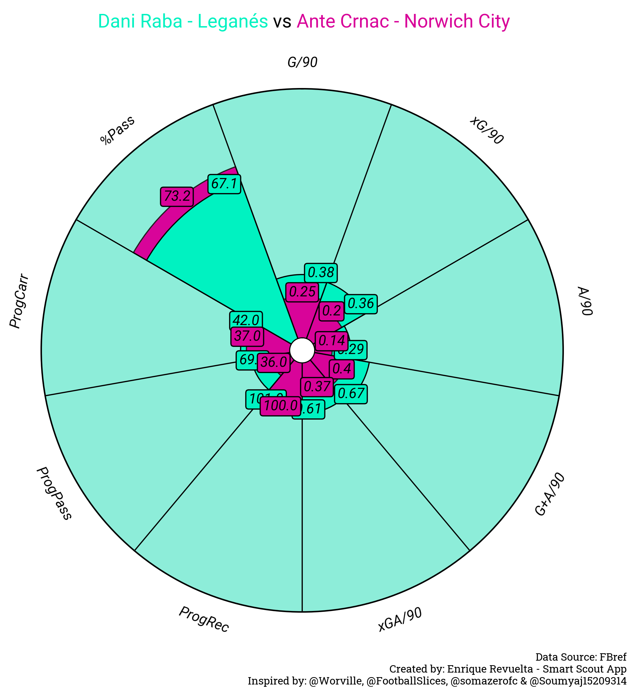

<h1 align="center">SMART SCOUT APP</h1>

<p align="center">
  
</p>

# 🚀 Welcome

Welcome to **Smart Scout App** — an application created to help football teams scout and evaluate new players. It assists in finding suitable replacements for players who leave the team or identifying similar profiles to those who have signed with other clubs.

# 🧱 Project Structure

This project is containerized using **Docker**. The technology stack includes:

* **Python + FastAPI** for the backend
* **LangChain** for agentic AI capabilities
* **Django** for the frontend
* **Jupyter Notebook** as a test and development environment

The project is composed of several Docker containers:

* `api`: Handles backend logic and exposes endpoints for the agent and frontend.
* `ingest`: Used to populate the database with player statistics and football news scraped from multiple sources.
* `web`: Contains the frontend logic and UI.
* `db` and `redis`: Databases and caching layers for persistent and fast-access storage.
* `jupyter`: Jupyter Lab instance for interactive development and testing.

### 🔗 Accessing the Services

After running `make up`, the services are accessible at:

| Service        | URL                                              |
| -------------- | ------------------------------------------------ |
| Frontend (web) | [https://localhost:8000](https://localhost:8000) |
| API (FastAPI)  | [http://localhost:8001](http://localhost:8001)   |
| Jupyter Lab    | [http://localhost:8888](http://localhost:8888)   |
| PostgreSQL     | localhost:5432 (internal only)                   |
| Redis          | localhost:6379 (internal only)                   |

> Note: The Jupyter container is useful for testing tools, exploring player stats, or running analytics manually.

# ⚙️ How to Initialize the Containers

We use a `Makefile` to simplify the most common Docker Compose operations. Below are the main commands available:

### 🔧 Build and Launch All Containers

Builds (if needed), recreates, and launches all services:

```bash
make up
```

### 💠 Build Only

Rebuilds all containers without starting them:

```bash
make build
```

### ⏹️ Stop All Containers

Stops running services without removing volumes or networks:

```bash
make stop
```

### 🧹 Remove Containers and Network (Keep Volumes)

Use this when you want to shut down everything but preserve your database data:

```bash
make down
```

### 💣 Remove Everything (Containers + Volumes)

This will remove **all containers, volumes, and networks**. Use with caution as it will delete persistent data:

```bash
make down-all
```

### 🔄 Quick Restart

Stops and immediately restarts all services (without losing data):

```bash
make restart
```

### 🧽 Deep Clean (Images, Builds, Volumes)

Removes unused Docker resources such as orphaned containers, networks, and build cache:

```bash
make prune
```

### 🧼 Full Clean and Rebuild

Performs a deep clean and then builds fresh images:

```bash
make clean
```

# 🕐 Populate the Databases

Once the containers are running, you can seed the PostgreSQL database with player statistics and ingest football news using the provided script.

### 1. Access the `web` container

```bash
docker compose exec web bash
```

> You can also use `api` or `ingest` if the script lives in one of those, depending on your architecture.

---

### 2. Run the ingestion script

Use the following command to populate both the players table (from a CSV) and ingest football news from RSS feeds:

```bash
python -m apps.ingestion.seed_and_ingest \
       --players-csv data/all_players_cleaned.csv \
       --ingest-news
```

> Make sure the file `data/all_players_cleaned.csv` exists and has the expected columns.

---

### 🔧 Optional Flags

You can customize the behavior of the script using these flags:

| Flag                 | Description                                      |
| -------------------- | ------------------------------------------------ |
| `--players-csv PATH` | Path to the CSV file containing player data      |
| `--ingest-news`      | Fetch and process latest football news           |
| `--skip-players`     | Skip player ingestion (useful for news-only run) |
| `--echo-sql`         | Print executed SQL statements (for debugging)    |

---

### 3. Exit the container

```bash
exit
```

# 🔹 System Architecture Diagram

```mermaid
flowchart TD
    subgraph Frontend
        Web[Web (Django)]
    end

    subgraph Backend
        API[API (FastAPI)]
        Agent[Agent Service]
        LangChain[LangChain]
        Jupyter[Jupyter Notebook]
    end

    subgraph Data
        Redis[(Redis)]
        Postgres[(PostgreSQL DB)]
        Ingest[Ingestion Service]
    end

    User[👤 User] --> Web
    Web --> API
    API --> Agent
    Agent --> LangChain
    Jupyter --> API
    API --> Redis
    API --> Postgres
    Ingest --> Postgres
    Ingest --> Redis
```

# 🧐 Agent Workflow Diagram

```mermaid
flowchart TD
    A[👤 User] -->|natural query| B[Scout Agent (LangChain)]
    B --> C[LLM with Functions (OpenAI)]
    B --> D[Conversation Memory]
    B --> E[Scouting System Prompt]

    subgraph Tools (LangChain)
      F1[player_lookup]
      F2[similar_players]
      F3[player_stats]
      F4[stats_table / compare_stats]
      F5[radar_chart / pizza_chart]
      F6[news_search / player_news]
      F7[dashboard_inline]
      F8[build_report_pdf]
    end

    C --> F1
    C --> F2
    C --> F3 --> F4
    C --> F5
    C --> F6
    C --> F7
    C --> F8

    F4 -->|HTML table| G1[UI Output]
    F5 -->|Chart Image| G1
    F7 -->|Inline Dashboard| G1
    F8 -->|PDF URL| G1
```

# 📄 Prompt Examples

Here are some useful prompts to try with the Smart Scout Agent:

| Prompt                                                                              | Expected Output                                                                   |
| ----------------------------------------------------------------------------------- | --------------------------------------------------------------------------------- |
| "We are looking for midfielders similar to Pedri under 25 years old"                | Returns a list of candidates with similar profiles using `similar_players`        |
| "Can you create a radar chart for Florian Wirtz?"                                   | Returns a radar chart image with performance metrics for Florian Wirtz            |
| "Generate a comparison table between Jamal Musiala and Jude Bellingham"             | Returns an HTML stats table comparing both players, with key metrics highlighted  |
| "What are the latest news about Arda Güler?"                                        | Fetches recent football news mentioning Arda Güler, including summaries and links |
| "Create an interactive dashboard for defenders similar to Antonio Rüdiger under 26" | Returns an embedded dashboard with top similar defenders and comparison options   |
| "Generate a PDF report for left-backs similar to Alphonso Davies under 25"          | Returns a download link to a detailed scouting report in PDF format including strengths, weaknesses, and final recommendation.               |

> The agent responds in the same language you use. You can write prompts in English or Spanish.

# 📸 Web Pages Walkthrough

## 📊 Home Page

<p align="center">
  <!-- Replace the src below with your real file path -->
  
</p>

## 📊 User Profile Page

<p align="center">
  <!-- Replace the src below with your real file path -->
  
</p>

## 📊 User Reports Page

<p align="center">
  <!-- Replace the src below with your real file path -->
  
</p>


# 📸 Example Outputs (Visuals)


## 📊 Radar Chart Example

<p align="center">
  <!-- Replace the src below with your real file path -->
  
</p>

## 📊 Radar Comparison Chart Example

<p align="center">
  <!-- Replace the src below with your real file path -->
  
</p>

## 📊 Pizza Chart Example

<p align="center">
  <!-- Replace the src below with your real file path -->
  
</p>

## 📊 Pizza Comparison Chart Example

<p align="center">
  <!-- Replace the src below with your real file path -->
  
</p>

## 📊 Interactive Dashboard Example

<p align="center">
  <!-- Replace the src below with your real file path -->
  
</p>

