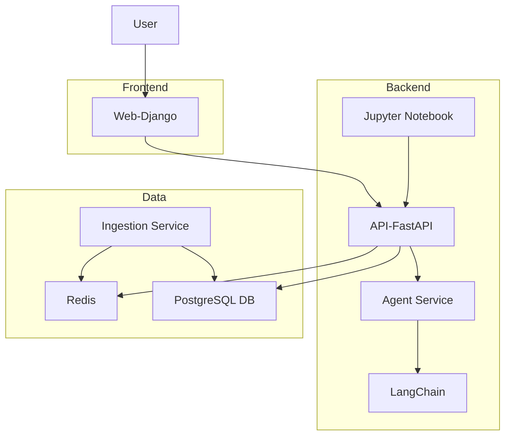
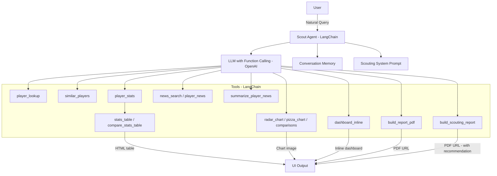
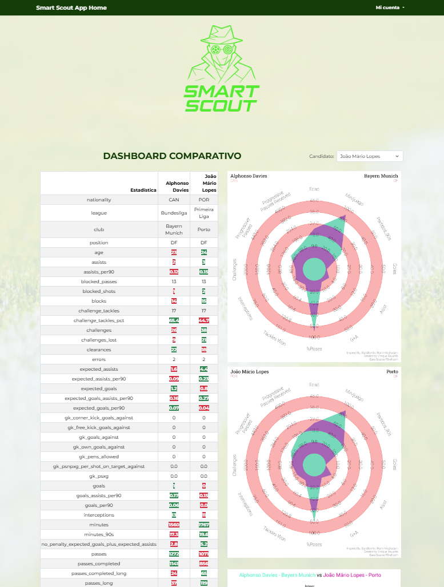

<h1 align="center">SMART SCOUT APP</h1>

<p align="center">
  
</p>

# 🚀 Welcome

Welcome to **Smart Scout App** — an application created to help football teams scout and evaluate new players. It assists in finding suitable replacements for players who leave the team or identifying similar profiles to those who have signed with other clubs.

# 🧱 Project Structure

This project is containerized using **Docker**. The technology stack includes:

* **Python + FastAPI** for the backend
* **LangChain** for agentic AI capabilities
* **Django** for the frontend
* **Jupyter Notebook** as a test and development environment

The project is composed of several Docker containers:

* `api`: Handles backend logic and exposes endpoints for the agent and frontend.
* `ingest`: Used to populate the database with player statistics and football news scraped from multiple sources.
* `web`: Contains the frontend logic and UI.
* `db` and `redis`: Databases and caching layers for persistent and fast-access storage.
* `jupyter`: Jupyter Lab instance for interactive development and testing.

### 🔐 Environment Variables

To run the project, copy the `.env.example` file and fill in your own keys:

```bash
cp .env.example .env
```

> Then, set your API keys and secrets accordingly.

### 🔗 Accessing the Services

After running `make up`, the services are accessible at:

| Service        | URL                                              |
| -------------- | ------------------------------------------------ |
| Frontend (web) | [https://localhost:8000](https://localhost:8000) |
| API (FastAPI)  | [http://localhost:8001](http://localhost:8001)   |
| Jupyter Lab    | [http://localhost:8888](http://localhost:8888)   |
| PostgreSQL     | localhost:5432 (internal only)                   |
| Redis          | localhost:6379 (internal only)                   |

> Note: The Jupyter container is useful for testing tools, exploring player stats, or running analytics manually.

# ⚙️ Makefile – Common Developer Tasks

The project ships with a root‑level **Makefile** that wraps the most frequent
Docker Compose commands.  
All targets are **idempotent** – running them twice in a row is safe.

| Target | What it does |
|--------|--------------|
| **`make up`** | Build images (if missing) **and** bring up the full stack (`api`, `web`, `db`, `redis`, `jupyter`). Uses `--force-recreate` so code changes are picked up. |
| **`make build`** | Only (re)build the images; nothing is started. |
| **`make up-db`** | Start **just** PostgreSQL (`db`) and Redis. Handy for one‑off scripts. |
| **`make ingest-full`** | ⬅️ **One‑off bootstrap**: <br>1. Ensures `db` + `redis` are running (`up-db`).<br>2. Runs the *ingestion* container with:<br>&nbsp;&nbsp;• `--replace` → truncates `players` & `player_news`<br>&nbsp;&nbsp;• loads `data/all_players_cleaned.csv`<br>&nbsp;&nbsp;• rebuilds embeddings (`--refresh-embs`)<br>&nbsp;&nbsp;• fetches & embeds the latest RSS news. |
| **`make ingest-news`** | Fetch & embed **only new** football‑news articles (does **not** touch players). |
| **`make stop`** | Stop all runtime containers, keep volumes & networks. |
| **`make down`** | Remove containers & network but **keep volumes** (DB data survives). |
| **`make down-all`** | Remove **everything** – containers **and** volumes. ⚠️ This deletes database data. |
| **`make restart`** | Convenience shortcut: `down` ➜ `up`. |
| **`make prune`** | Aggressive Docker clean‑up (orphan images, networks, volumes). |
| **`make clean`** | `prune` followed by a fresh `build`. |

---

## 🔰 Typical workflows

### First‑time bootstrap

```bash
# Build images + run full ingestion (players + embeddings + news)
make ingest-full
```

### Daily cron / manual refresh of news only

```bash
make ingest-news
```

### Build and launch api, web and jupyter enviroments

```bash
# Build and launch all the services necessary for the app workflow (api, db, redis, web & jupyter)
make up
```

### Re‑run the stack after code changes

```bash
make restart
```

### Full reset (wipe DB – irreversible)

```bash
make down-all
make ingest-full
```

---

## 📝 Notes

* `make ingest-*` uses `docker compose run --rm --build ingestion …`  
  – it **builds** the `ingestion` image if needed  
  – runs a **one‑off** container and removes it afterwards.
* All long‑running services (`api`, `web`, etc.) stay up and keep using the
  shared `pgdata` volume.
* If you add or rename services, update the `SERVICES` variable at the top of
  the Makefile and regenerate this section.

# 🕐 Populate the Databases

Once the containers are running you can load player statistics **and** ingest football news with a single command‑line script.

---

## 1 · Open a shell in the `web` (Django) container

```bash
docker compose exec web bash
```

*(You can run the same commands inside the `api` container if you prefer.)*

---

## 2 · Run the ingestion script

Typical first‑time bootstrap: load a clean **players** table, build embeddings and ingest the latest news feeds.

```bash
python -m apps.ingestion.seed_and_ingest \
       --players-csv data/all_players_cleaned.csv \
       --replace            \  # truncates players & player_news only
       --refresh-embs       \  # recomputes the 43‑D feature_vector
       --ingest-news
```

> Make sure `data/all_players_cleaned.csv` exists and contains the required columns.

---

## 🔧 CLI flags (quick reference)

| Flag | Purpose |
|------|---------|
| `--players-csv PATH` | CSV file with the raw player stats |
| `--replace` | **Truncate** `players` and `player_news` before inserting (keeps `football_news` intact) |
| `--refresh-embs` | Recompute **all** player `feature_vector` embeddings even if they already exist |
| `--ingest-news` | Fetch, summarise, embed and upsert the latest football‑news RSS items |
| `--skip-players` | Skip the player CSV step (news‑only run) |
| `--echo-sql` | Print every SQL statement for debugging |

---

### Examples

```bash
# News‑only run (do not touch players)
python -m apps.ingestion.seed_and_ingest --ingest-news --skip-players

# Re‑scale or change vector features without reloading CSV
python -m apps.ingestion.seed_and_ingest --refresh-embs --skip-players
```

---

## 3 · Exit the container

```bash
exit
```

# 🔹 System Architecture Diagram



# 🧐 Agent Workflow Diagram



# 📄 Prompt Examples

Here are some useful prompts to try with the Smart Scout Agent:

| Prompt                                                                              | Expected Output                                                                   |
| ----------------------------------------------------------------------------------- | --------------------------------------------------------------------------------- |
| "We are looking for midfielders similar to Pedri under 25 years old"                | Returns a list of candidates with similar profiles using `similar_players`        |
| "Can you create a radar chart for Florian Wirtz?"                                   | Returns a radar chart image with performance metrics for Florian Wirtz            |
| "Generate a comparison table between Jamal Musiala and Jude Bellingham"             | Returns an HTML stats table comparing both players, with key metrics highlighted  |
| "What are the latest news about Arda Güler?"                                        | Fetches recent football news mentioning Arda Güler, including summaries and links |
| "Create an interactive dashboard for defenders similar to Antonio Rüdiger under 26" | Returns an embedded dashboard with top similar defenders and comparison options   |
| "Generate a PDF report for left-backs similar to Alphonso Davies under 25"          | Returns a download link to a detailed scouting report in PDF format including strengths, weaknesses, and final recommendation.               |

> The agent responds in the same language you use. You can write prompts in English or Spanish.

# 📸 Web Pages Walkthrough

## 📊 Home Page

<p align="center">
  <!-- Replace the src below with your real file path -->
  
</p>

## 📊 User Profile Page

<p align="center">
  <!-- Replace the src below with your real file path -->
  
</p>

## 📊 User Reports Page

<p align="center">
  <!-- Replace the src below with your real file path -->
  
</p>


# 📸 Example Outputs (Visuals)


## 📊 Radar Chart Example

<p align="center">
  <!-- Replace the src below with your real file path -->
  
</p>

## 📊 Radar Comparison Chart Example

<p align="center">
  <!-- Replace the src below with your real file path -->
  
</p>

## 📊 Pizza Chart Example

<p align="center">
  <!-- Replace the src below with your real file path -->
  
</p>

## 📊 Pizza Comparison Chart Example

<p align="center">
  <!-- Replace the src below with your real file path -->
  
</p>

## 📊 Interactive Dashboard Example

<p align="center">
  <!-- Replace the src below with your real file path -->
  
</p>

