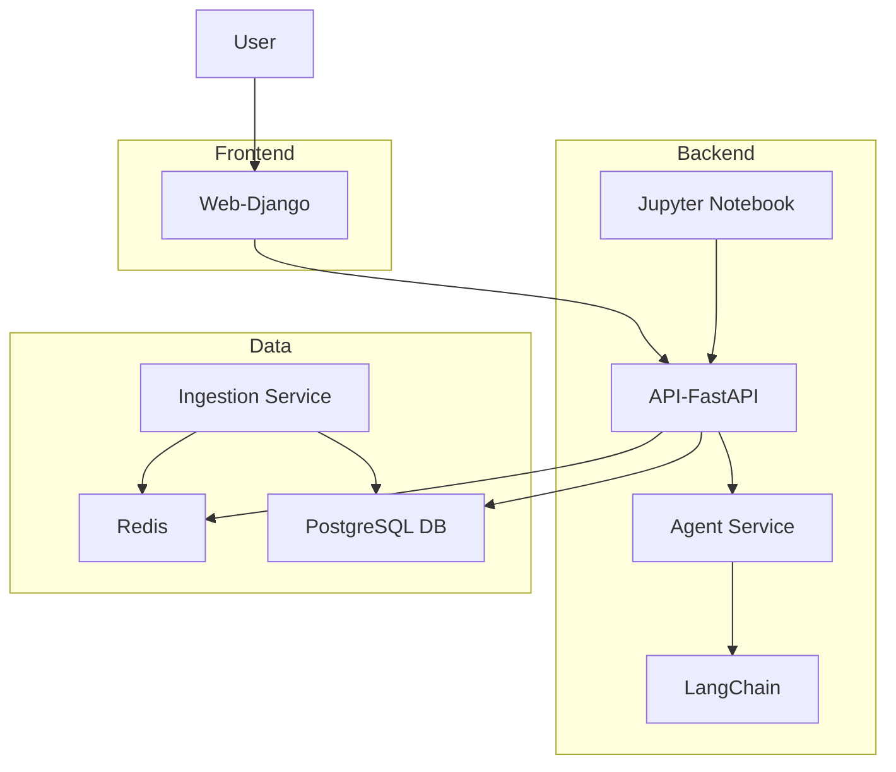
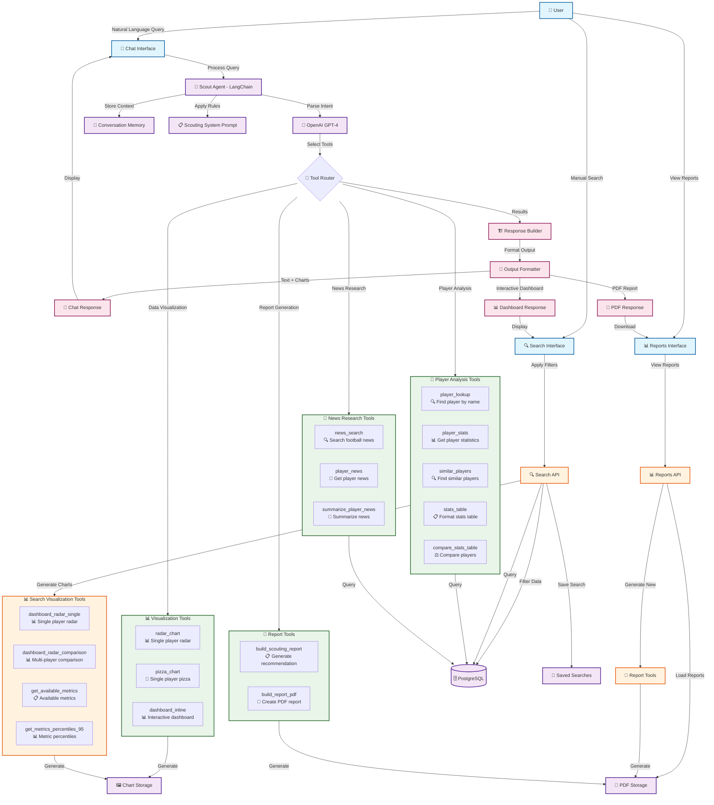

<h1 align="center">SMART SCOUT APP v1.0</h1>

<p align="center">
  
</p>

# 🚀 Welcome

Welcome to **Smart Scout App v1.0** — an application created to help football teams scout and evaluate new players. It assists in finding suitable replacements for players who leave the team or identifying similar profiles to those who have signed with other clubs.

## ✨ Features Overview

### 🤖 AI-Powered Scouting
- **Intelligent Player Recommendations**: AI agent analyzes player data and provides recommendations
- **Natural Language Queries**: Ask questions in plain English or Spanish
- **Comprehensive Reports**: Generate detailed PDF reports with analysis and recommendations

### 🔍 Manual Search & Analysis
- **Advanced Player Search**: Filter players by multiple criteria
- **Visual Comparisons**: Interactive radar and pizza charts
- **Saved Searches**: Store and reuse search configurations
- **Real-time Filtering**: Instant results as you type

### 📊 Data Visualization
- **Radar Charts**: Individual and comparison radar charts
- **Pizza Charts**: Performance breakdown visualizations
- **Interactive Dashboards**: Embedded comparison interfaces
- **Export Capabilities**: Download charts and data

### 📰 News Integration
- **Player News**: Latest news about specific players
- **News Summarization**: AI-powered news summaries
- **Semantic Search**: Find relevant news using natural language

# 🧱 Project Structure

This project is containerized using **Docker**. The technology stack includes:

* **Python + FastAPI** for the backend
* **LangChain** for agentic AI capabilities
* **Django** for the frontend
* **Jupyter Notebook** as a test and development environment

The project is composed of several Docker containers:

* `api`: Handles backend logic and exposes endpoints for the agent and frontend.
* `ingest`: Used to populate the database with player statistics and football news scraped from multiple sources.
* `web`: Contains the frontend logic and UI.
* `db` and `redis`: Databases and caching layers for persistent and fast-access storage.
* `jupyter`: Jupyter Lab instance for interactive development and testing.

### 🔐 Environment Variables

To run the project, copy the `.env.example` file and fill in your own keys:

```bash
cp .env.example .env
```

> Then, set your API keys and secrets accordingly.

### 🔗 Accessing the Services

After running `make up`, the services are accessible at:

| Service | URL | Description |
|---------|-----|-------------|
| Frontend (web) | [https://localhost:8000](https://localhost:8000) | Main application interface |
| Player Search | [https://localhost:8000/dashboard/search/](https://localhost:8000/dashboard/search/) | Manual player search dashboard |
| User Reports | [https://localhost:8000/chat/](https://localhost:8000/chat/) | AI-powered scouting reports |
| API (FastAPI) | [http://localhost:8001](http://localhost:8001) | Backend API endpoints |
| Jupyter Lab | [http://localhost:8888](http://localhost:8888) | Development environment |
| PostgreSQL | localhost:5432 (internal only) | Database |
| Redis | localhost:6379 (internal only) | Cache layer |

> Note: The Jupyter container is useful for testing tools, exploring player stats, or running analytics manually.

# ⚙️ Makefile – Common Developer Tasks

The project ships with a root‑level **Makefile** that wraps the most frequent
Docker Compose commands.  
All targets are **idempotent** – running them twice in a row is safe.

| Target | What it does |
|--------|--------------|
| **`make up`** | Build images (if missing) **and** bring up the full stack (`api`, `web`, `db`, `redis`, `jupyter`). Uses `--force-recreate` so code changes are picked up. |
| **`make build`** | Only (re)build the images; nothing is started. |
| **`make up-db`** | Start **just** PostgreSQL (`db`) and Redis. Handy for one‑off scripts. |
| **`make ingest-full`** | ⬅️ **One‑off bootstrap**: <br>1. Ensures `db` + `redis` are running (`up-db`).<br>2. Runs the *ingestion* container with:<br>&nbsp;&nbsp;• `--replace` → truncates `players` & `player_news`<br>&nbsp;&nbsp;• loads `data/all_players_cleaned.csv`<br>&nbsp;&nbsp;• rebuilds embeddings (`--refresh-embs`)<br>&nbsp;&nbsp;• fetches & embeds the latest RSS news. |
| **`make ingest-news`** | Fetch & embed **only new** football‑news articles (does **not** touch players). |
| **`make stop`** | Stop all runtime containers, keep volumes & networks. |
| **`make down`** | Remove containers & network but **keep volumes** (DB data survives). |
| **`make down-all`** | Remove **everything** – containers **and** volumes. ⚠️ This deletes database data. |
| **`make restart`** | Convenience shortcut: `down` ➜ `up`. |
| **`make prune`** | Aggressive Docker clean‑up (orphan images, networks, volumes). |
| **`make clean`** | `prune` followed by a fresh `build`. |

---

## 🔰 Typical workflows

### First‑time bootstrap

```bash
# Build images + run full ingestion (players + embeddings + news)
make ingest-full
```

### Daily cron / manual refresh of news only

```bash
make ingest-news
```

### Build and launch api, web and jupyter enviroments

```bash
# Build and launch all the services necessary for the app workflow (api, db, redis, web & jupyter)
make up
```

### Re‑run the stack after code changes

```bash
make restart
```

### Full reset (wipe DB – irreversible)

```bash
make down-all
make ingest-full
```

---

## 📝 Notes

* `make ingest-*` uses `docker compose run --rm --build ingestion …`  
  – it **builds** the `ingestion` image if needed  
  – runs a **one‑off** container and removes it afterwards.
* All long‑running services (`api`, `web`, etc.) stay up and keep using the
  shared `pgdata` volume.
* If you add or rename services, update the `SERVICES` variable at the top of
  the Makefile and regenerate this section.

# 🕐 Populate the Databases

Once the core services (`db`, `redis`, etc.) are running you have **two equivalent ways** to load player data, build embeddings and ingest news.

---

## 1 · Run the ingestion script _inside_ a container (classic way)

### 1‑a · Open a shell

```bash
docker compose exec web bash      # or: docker compose exec api bash
```

### 1‑b · Bootstrap players **and** news

```bash
python -m apps.ingestion.seed_and_ingest        --players-csv data/all_players_cleaned.csv        --replace            \  # ↺ truncates players & player_news
       --refresh-embs       \  # ↺ rebuilds the 43‑D feature_vector
       --ingest-news
```

*Use `--skip-players` + `--ingest-news` when you only want fresh articles.*

---

## 2 · Use the dedicated *ingestion* service (preferred)

The `docker-compose.yml` defines a one‑shot service called **`ingestion`**.  
The Makefile wraps it with two handy targets:

| Command | What it does |
|---------|--------------|
| `make ingest-full` | Build & Runs the container with `INGEST_MODE=""` → full bootstrap (players + embeddings + news). |
| `make ingest-news` | Runs the container with `INGEST_MODE=news` → fetch & embed **only new** news items. |

These targets automatically ensure `db` and `redis` are up, build the image if needed, execute the job and remove the temporary container.

```bash
# First‑time load (or when you want a hard refresh)
make ingest-full

# Daily cron / manual refresh of news only
make ingest-news
```

---

## CLI flags (quick reference)

| Flag | Purpose |
|------|---------|
| `--players-csv PATH` | CSV with raw player stats |
| `--replace` | Truncate `players` and `player_news` before inserting |
| `--refresh-embs` | Recompute every `feature_vector` with StandardScaler + pgvector |
| `--ingest-news` | Fetch, summarise, embed and upsert RSS news |
| `--skip-players` | Skip player ingestion (news‑only run) |
| `--echo-sql` | Verbose SQL for debugging |

*(See `python -m apps.ingestion.seed_and_ingest --help` for all options.)*

# 🔹 System Architecture Diagram


```mermaid
flowchart TD
    subgraph Frontend
        Web[Web-Django]
    end

    subgraph Backend
        API[API-FastAPI]
        Agent[Agent Service]
        LangChain[LangChain]
        Jupyter[Jupyter Notebook]
    end

    subgraph Data
        Redis[Redis]
        Postgres[PostgreSQL DB]
        Ingest[Ingestion Service]
    end

    User[User] --> Web
    Web --> API
    API --> Agent
    Agent --> LangChain
    Jupyter --> API
    API --> Redis
    API --> Postgres
    Ingest --> Postgres
    Ingest --> Redis
```

# 🧐 Application Workflow Diagram


```mermaid
flowchart TD
    %% User Entry Points
    User[👤 User] -->|"Natural Language Query"| ChatInterface[💬 Chat Interface]
    User -->|"Manual Search"| SearchInterface[🔍 Search Interface]
    User -->|"View Reports"| ReportsInterface[📊 Reports Interface]
    
    %% Chat Flow - AI Agent
    ChatInterface -->|"Process Query"| Agent[🤖 Scout Agent - LangChain]
    Agent -->|"Parse Intent"| LLM[🧠 OpenAI GPT-4]
    Agent -->|"Store Context"| Memory[💾 Conversation Memory]
    Agent -->|"Apply Rules"| SystemPrompt[📋 Scouting System Prompt]
    
    %% Tool Selection & Execution
    LLM -->|"Select Tools"| ToolRouter{🔀 Tool Router}
    
    %% Chat Flow Tools
    ToolRouter -->|"Player Analysis"| ChatPlayerTools[👥 Player Analysis Tools]
    ToolRouter -->|"News Research"| ChatNewsTools[📰 News Research Tools]
    ToolRouter -->|"Data Visualization"| ChatVizTools[📊 Visualization Tools]
    ToolRouter -->|"Report Generation"| ChatReportTools[📄 Report Tools]
    
    %% Chat Player Tools Detail
    subgraph ChatPlayerTools[👥 Player Analysis Tools]
        CPT1[player_lookup<br/>🔍 Find player by name]
        CPT2[player_stats<br/>📊 Get player statistics]
        CPT3[similar_players<br/>🔍 Find similar players]
        CPT4[stats_table<br/>📋 Format stats table]
        CPT5[compare_stats_table<br/>⚖️ Compare players]
    end
    
    %% Chat News Tools Detail
    subgraph ChatNewsTools[📰 News Research Tools]
        CNT1[news_search<br/>🔍 Search football news]
        CNT2[player_news<br/>👤 Get player news]
        CNT3[summarize_player_news<br/>📝 Summarize news]
    end
    
    %% Chat Visualization Tools Detail
    subgraph ChatVizTools[📊 Visualization Tools]
        CVT1[radar_chart<br/>📊 Single player radar]
        CVT2[pizza_chart<br/>🍕 Single player pizza]
        CVT3[dashboard_inline<br/>📊 Interactive dashboard]
    end
    
    %% Chat Report Tools Detail
    subgraph ChatReportTools[📄 Report Tools]
        CRT1[build_scouting_report<br/>📋 Generate recommendation]
        CRT2[build_report_pdf<br/>📄 Create PDF report]
    end
    
    %% Manual Search Flow
    SearchInterface -->|"Apply Filters"| SearchAPI[🔍 Search API]
    SearchAPI -->|"Filter Data"| Database[(🗄️ PostgreSQL)]
    SearchAPI -->|"Generate Charts"| SearchVizTools[📊 Search Visualization Tools]
    SearchAPI -->|"Save Search"| SavedSearches[💾 Saved Searches]
    
    %% Manual Search Visualization Tools
    subgraph SearchVizTools[📊 Search Visualization Tools]
        SVT1[dashboard_radar_single<br/>📊 Single player radar]
        SVT2[dashboard_radar_comparison<br/>📊 Multi-player comparison]
        SVT3[get_available_metrics<br/>📋 Available metrics]
        SVT4[get_metrics_percentiles_95<br/>📊 Metric percentiles]
    end
    
    %% Reports Flow
    ReportsInterface -->|"View Reports"| ReportsAPI[📊 Reports API]
    ReportsAPI -->|"Load Reports"| PDFStorage[📁 PDF Storage]
    ReportsAPI -->|"Generate New"| ReportTools[📄 Report Tools]
    
    %% Data Sources
    ChatPlayerTools -->|"Query"| Database
    ChatNewsTools -->|"Query"| Database
    SearchAPI -->|"Query"| Database
    ChatVizTools -->|"Generate"| ChartStorage[🖼️ Chart Storage]
    SearchVizTools -->|"Generate"| ChartStorage
    ChatReportTools -->|"Generate"| PDFStorage
    ReportTools -->|"Generate"| PDFStorage
    
    %% Output Generation
    ToolRouter -->|"Results"| ResponseBuilder[🏗️ Response Builder]
    ResponseBuilder -->|"Format Output"| OutputFormatter[📝 Output Formatter]
    
    %% Output Types
    OutputFormatter -->|"Text + Charts"| ChatResponse[💬 Chat Response]
    OutputFormatter -->|"Interactive Dashboard"| DashboardResponse[📊 Dashboard Response]
    OutputFormatter -->|"PDF Report"| PDFResponse[📄 PDF Response]
    
    %% User Interfaces
    ChatResponse -->|"Display"| ChatInterface
    DashboardResponse -->|"Display"| SearchInterface
    PDFResponse -->|"Download"| ReportsInterface
    
    %% Styling
    classDef userInterface fill:#e1f5fe,stroke:#01579b,stroke-width:2px
    classDef agent fill:#f3e5f5,stroke:#4a148c,stroke-width:2px
    classDef chatTools fill:#e8f5e8,stroke:#1b5e20,stroke-width:2px
    classDef searchTools fill:#fff3e0,stroke:#e65100,stroke-width:2px
    classDef data fill:#f3e5f5,stroke:#4a148c,stroke-width:2px
    classDef output fill:#fce4ec,stroke:#880e4f,stroke-width:2px
    
    class User,ChatInterface,SearchInterface,ReportsInterface userInterface
    class Agent,LLM,Memory,SystemPrompt agent
    class ChatPlayerTools,ChatNewsTools,ChatVizTools,ChatReportTools chatTools
    class SearchVizTools,SearchAPI,ReportsAPI,ReportTools searchTools
    class Database,ChartStorage,PDFStorage,SavedSearches data
    class ResponseBuilder,OutputFormatter,ChatResponse,DashboardResponse,PDFResponse output
```

# 📄 Prompt Examples

Here are some useful prompts to try with the Smart Scout Agent:

| Prompt | Expected Output |
|--------|----------------|
| "We are looking for midfielders similar to Pedri under 25 years old" | Returns a list of candidates with similar profiles using `similar_players` |
| "Can you create a radar chart for Florian Wirtz?" | Returns a radar chart image with performance metrics for Florian Wirtz |
| "Generate a comparison table between Jamal Musiala and Jude Bellingham" | Returns an HTML stats table comparing both players, with key metrics highlighted |
| "What are the latest news about Arda Güler?" | Fetches recent football news mentioning Arda Güler, including summaries and links |
| "Create an interactive dashboard for defenders similar to Antonio Rüdiger under 26" | Returns an embedded dashboard with top similar defenders and comparison options |
| "Generate a PDF report for left-backs similar to Alphonso Davies under 25" | Returns a download link to a detailed scouting report in PDF format including strengths, weaknesses, and final recommendation |
| "Open the manual search dashboard" | Redirects to the player search interface with filtering options |
| "Find all Spanish midfielders under 25 in La Liga" | Returns filtered results with Spanish midfielders from La Liga |
| "Compare the top 3 similar players to Pedri" | Shows comparison radar chart with 3 most similar players |
| "Save this search as 'Young Spanish Midfielders'" | Saves the current search configuration for future use |

> The agent responds in the same language you use. You can write prompts in English or Spanish.

# 📸 Web Pages Walkthrough

## 📊 Home Page

<p align="center">
  <!-- Replace the src below with your real file path -->
  
</p>

## 📊 User Profile Page

<p align="center">
  <!-- Replace the src below with your real file path -->
  
</p>

## 📊 User Reports Page

<p align="center">
  <!-- Replace the src below with your real file path -->
  
</p>

## 🔍 Manual Player Search Dashboard

The application now includes a comprehensive manual search interface that allows users to:

- **Search players by name** with real-time filtering
- **Apply multiple filters**: position, age range, league, club, nationality, minutes played
- **Compare up to 3 players** with interactive radar charts
- **Save search configurations** for future use
- **Export comparison data** for further analysis

### Key Features:
- **Advanced Filtering**: Filter by position (GK, DF, MF, FW), age range, league, club, and playing time
- **Real-time Search**: Instant results as you type player names
- **Visual Comparisons**: Side-by-side radar charts for up to 3 players
- **Saved Searches**: Store and reuse complex search configurations
- **Responsive Design**: Works seamlessly on desktop and mobile devices

### Access:
Navigate to the "Search Players" option from the main dashboard to access the manual search interface.


# 📸 Example Outputs (Visuals)


## 📊 Radar Chart Example

<p align="center">
  <!-- Replace the src below with your real file path -->
  
</p>

## 📊 Radar Comparison Chart Example

<p align="center">
  <!-- Replace the src below with your real file path -->
  
</p>

## 📊 Pizza Chart Example

<p align="center">
  <!-- Replace the src below with your real file path -->
  
</p>

## 📊 Pizza Comparison Chart Example

<p align="center">
  <!-- Replace the src below with your real file path -->
  
</p>

## 📊 Interactive Dashboard Example

<p align="center">
  <!-- Replace the src below with your real file path -->
  
</p>

# 🛠️ Technical Improvements

## Code Quality & Documentation
- **Complete English Translation**: All code comments, docstrings, and documentation translated to English
- **Improved Code Documentation**: Enhanced function descriptions and parameter documentation
- **Consistent Code Style**: Standardized naming conventions and code structure

## User Experience Enhancements
- **Accessibility Improvements**: Enhanced keyboard navigation and screen reader support
- **Responsive Design**: Optimized layouts for all device sizes
- **Visual Feedback**: Improved loading states and user interaction feedback

## Performance Optimizations
- **Efficient Data Processing**: Optimized database queries and data serialization
- **Caching Strategies**: Implemented smart caching for frequently accessed data
- **Memory Management**: Improved memory usage in data processing pipelines

# 📋 Release Notes - Version 1.0

## 🎉 Initial Release Features

### Core Functionality
- ✅ **AI-Powered Scouting Agent**: Intelligent player analysis and recommendations
- ✅ **Manual Player Search**: Advanced filtering and comparison tools
- ✅ **Data Visualization**: Radar charts, pizza charts, and interactive dashboards
- ✅ **News Integration**: Player news with AI-powered summarization
- ✅ **PDF Report Generation**: Comprehensive scouting reports with recommendations

### Technical Features
- ✅ **Multi-language Support**: English and Spanish interface
- ✅ **Responsive Design**: Works on desktop, tablet, and mobile devices
- ✅ **Accessibility**: Screen reader support and keyboard navigation
- ✅ **Docker Containerization**: Easy deployment and development setup
- ✅ **Real-time Search**: Instant filtering and search results

### Data & Analytics
- ✅ **Player Database**: Comprehensive player statistics and metrics
- ✅ **News Scraping**: Automated football news collection and processing
- ✅ **Semantic Search**: AI-powered content discovery
- ✅ **Saved Searches**: Store and reuse search configurations
- ✅ **Export Capabilities**: Download charts, reports, and data

## 🚀 Getting Started

1. **Clone the repository**
2. **Set up environment variables** (copy `.env.example` to `.env`)
3. **Run the application**: `make up`
4. **Access the interface**: [https://localhost:8000](https://localhost:8000)

## 📞 Support

For questions, issues, or feature requests, please refer to the project documentation or create an issue in the repository.

---

**Smart Scout App v1.0** - Empowering football teams with intelligent player scouting technology.

