<h1 align="center">SMART SCOUT APP v1.6.3</h1>

<p align="center">
  
</p>

<p align="center">
  <em>AI-powered football scouting platform with FIFA-style ratings, intelligent recommendations, and comprehensive player analysis</em>
</p>

---

## 📑 Table of Contents

- [Overview](#-overview)
- [Key Features](#-key-features)
- [Quick Start](#-quick-start)
- [FIFA-Style Rating System](#-fifa-style-rating-system)
- [Success Index & Viability Score](#-success-index--viability-score)
- [System Architecture](#-system-architecture)
- [User Guide](#-user-guide)
- [Developer Guide](#-developer-guide)
- [Testing](#-testing)
- [Version Releases](#-version-releases)
- [Release Notes](#-release-notes)

---

# 🌟 Overview

**Smart Scout App v1.6.3** is an advanced football scouting platform that helps teams discover, evaluate, and compare players using AI-powered analysis, FIFA-style ratings, and comprehensive statistical insights.

## What Makes Smart Scout Unique?

- 🤖 **AI-Powered Recommendations**: Natural language queries with intelligent player analysis
- ⭐ **FIFA-Style Ratings**: Instant 0-100 player evaluation across 6 core attributes
- 📊 **Historical Data**: 11 seasons (2014-2025) covering 46,000+ unique players
- 🎯 **Success Index v2.1**: Advanced scoring system predicting signing probability
- 🔍 **Advanced Search**: Manual filtering with visual comparisons (radar/pizza charts)
- 📰 **News Integration**: Real-time football news with AI summaries
- 📄 **PDF Reports**: Professional scouting reports with detailed recommendations

---

# ✨ Key Features

## 🤖 AI-Powered Scouting

### Natural Language Queries
Ask questions in English or Spanish with intelligent language detection:
- *"Find players similar to Pedri for Real Madrid"*
- *"Who can replace Rodri at Manchester City?"*
- *"Generate a PDF report for left-backs under 25 similar to Alphonso Davies"*
- *"Could you find and create a summary of the news about Teun Koopmeiners?"*

**Smart Language Detection**: The agent automatically detects your language and responds accordingly, switching seamlessly between English and Spanish within the same conversation.

### Agent Transparency (v1.6.1+)
Real-time visibility into agent's execution process with optimized routing:
- 📥 **Request**: Agent receives your natural language query
- 🎯 **Route**: Nuclear prompt logic determines optimal tool
- ⚡ **Execute**: Direct tool execution with minimal overhead
- Live streaming of tool execution with visual indicators
- **Dynamic Language Headers**: Response adapts to your language (English/Spanish)

### Agent Capabilities
- **18 Specialized Tools**: Player search, similarity analysis, statistics, visualizations, reports
- **Conversation Memory**: Context persisted across turns (Redis-backed)
- **Multi-lingual**: Responds in English or Spanish
- **Thread-Safe**: Isolated user contexts for concurrent requests

---

## ⭐ FIFA-Style Rating System (v1.6)

### Overall Rating (OVR)
```
OVR = (League Base Rating × 60%) + (Performance Rating × 40%)
```

### Six Core Attributes (0-100)

| Attribute | Focus | Key Metrics |
|-----------|-------|-------------|
| **ATT** | Attacking | Goals, xG, Assists, Progressive Passes Received |
| **PLY** | Playmaking | Assists, xA, Pass Completion, Progressive Passes |
| **DEF** | Defending | Tackles, Interceptions, Clearances, Blocks |
| **CTR** | Control | Pass %, Completed Passes, Progressive Carries |
| **PHY** | Physical | Tackles, Carries, Clearances (+ League Base) |
| **GKP** | Goalkeeping | Goals Against, PSxG (+ League Base, 1100-min blending) |

### Position-Specific Weights

| Position | ATT | PLY | DEF | CTR | PHY | GKP |
|----------|-----|-----|-----|-----|-----|-----|
| **GK** | 0% | 0% | 10% | 0% | 10% | 80% |
| **DF** | 10% | 20% | 35% | 10% | 25% | 0% |
| **MF** | 20% | 35% | 15% | 20% | 10% | 0% |
| **FW** | 45% | 20% | 0% | 25% | 10% | 0% |

### Team Ratings (Position-Weighted)

| Attribute | FW | MF | DF | GK | Description |
|-----------|----|----|----|----|-------------|
| **ATT** | 60% | 30% | 10% | 0% | Attack driven by forwards |
| **DEF** | 10% | 35% | 50% | 5% | Defense led by defenders, GK contributes |
| **PLY** | 40% | 40% | 20% | 0% | Playmaking balanced between FW and MF |
| **CTR** | 40% | 40% | 20% | 0% | Control balanced between FW and MF |
| **PHY** | 33% | 33% | 33% | 0% | Physical attributes equal across outfield |
| **GKP** | 0% | 0% | 0% | 100% | Only goalkeepers (with 1100-min blending) |

**Example: Real Madrid (La Liga 2024-25)**
- Overall: 83.1 | ATT: 74 | PLY: 81 | DEF: 55 | CTR: 87 | PHY: 75 | GKP: 67

---

## 🎯 Success Index v2.1 & Viability Score

### Success Index Formula
```
Success Index = base_similarity × league_weight × minutes_weight 
                × age_weight × team_strength_weight × position_adjustment
```

### Viability Score Formula
```
Viability Score = Success Index v2.1 × Feasibility Multiplier
```

### Weight Factors

#### 1️⃣ League Weight (5 Tiers)
| Tier | Weight | Examples |
|------|--------|----------|
| Tier 1 | 1.0 | Premier League, La Liga, Bundesliga, Serie A, Ligue 1 |
| Tier 2 | 0.85 | Eredivisie, Primeira Liga, Brasileirao |
| Tier 3 | 0.70 | Championship, Liga Hipermotion, Saudi Pro |
| Tier 4 | 0.55 | Danish Superliga, Croatian League |
| Tier 5 | 0.40 | MLS, J1 League, Chinese Super League |

#### 2️⃣ Minutes Weight
| Minutes | Weight | Status |
|---------|--------|--------|
| ≥2000 | 1.00 | 🟢 Starter |
| 1500-1999 | 0.90 | 🟢 Regular |
| 1000-1499 | 0.75 | 🟡 Rotation |
| 700-999 | 0.60 | 🟡 Substitute |
| 400-699 | 0.45 | 🔴 Backup |
| <400 | 0.30 | 🔴 Limited |

#### 3️⃣ Age Weight
| Age | Weight | Category |
|-----|--------|----------|
| 21-27 | 1.00 | 🟢 Optimal |
| 18-20 | 0.95 | 🟢 Young |
| 28-29 | 0.95 | 🟢 Experience |
| 30-31 | 0.85 | 🟡 Veteran |
| 32-33 | 0.70 | 🟠 Risk |
| ≥34 | 0.55 | 🔴 High Risk |

#### 4️⃣ Feasibility Multipliers
| Scenario | Multiplier | Status |
|----------|------------|--------|
| Tier 2-3 league player | 1.2× | 🟢 Very Feasible |
| Rotation player from any league | 1.1× | 🟢 Feasible |
| Starter from mid-table Top 5 club | 0.85× | 🟡 Medium |
| Star from competitive club | 0.75× | 🟡 Medium |
| Direct rival transfer | 0.3× | 🔴 Very Low |
| Club legend from rival | 0.1× | 🔴 Nearly Impossible |

### Rivalry Matrix
| Rival Pairs | Multiplier |
|-------------|------------|
| Barcelona ↔ Real Madrid | 0.3× |
| Manchester United ↔ Manchester City | 0.3× |
| Arsenal ↔ Tottenham | 0.3× |
| Liverpool ↔ Everton | 0.3× |
| AC Milan ↔ Inter Milan | 0.3× |

---

## 📊 Historical Data

### Coverage
- **Seasons**: 
  - Top 5 European Leagues: 2014-15 to 2024-25 (11 seasons)
  - Secondary Leagues (25): 2019-20 to 2024-25 (6 seasons)
- **Unique Players**: 45,120 (improved with disambiguation + secondary leagues)
- **Seasonal Records**: 131,854 for evolution tracking
- **Active Players**: 45119 with FIFA-style ratings 
- **Leagues**: Top 5 European + 25 secondary leagues

### Dual Data Structure
1. **`players` table**: Aggregated profiles for similarity search
2. **`player_history` table**: Seasonal records for evolution tracking
3. **`player_ratings` table**: Ratings similar to FIFA Game based on real metrics

### Player Disambiguation (v1.6)
- **`player_uid`**: name + birth_year for unique identification
- Prevents same-name conflicts (e.g., 4 different "Rodri" players)

---

# 🚀 Quick Start

## Prerequisites
- Docker & Docker Compose
- `.env` file with API keys (copy from `.env.example`)

## Installation

### 1. First-Time Setup
```bash
# Clone the repository
git clone <repository-url>
cd smart_scout_app

# Set up environment variables
cp .env.example .env
# Edit .env and add your API keys

# Build and run full ingestion (players + news)
make ingest-full
```

### 2. Start the Application
```bash
# Launch all services (api, web, db, redis, jupyter)
make up
```

### 3. Access Services

| Service | URL | Description |
|---------|-----|-------------|
| **Frontend** | [https://localhost:8000](https://localhost:8000) | Main application |
| **Player Search** | [https://localhost:8000/dashboard/search/](https://localhost:8000/dashboard/search/) | Manual search |
| **AI Reports** | [https://localhost:8000/chat/](https://localhost:8000/chat/) | AI agent chat |
| **API** | [http://localhost:8001](http://localhost:8001) | Backend API |
| **API Docs** | [http://localhost:8001/docs](http://localhost:8001/docs) | Interactive API explorer |
| **Jupyter Lab** | [http://localhost:8888](http://localhost:8888) | Development environment |

---

## Common Commands

### 🚀 Service Management
```bash
# Start services (uses existing images, fast)
make up

# Build images and start services (complete setup)
make build

# Start core services only (api, web, db, redis)
make up-core

# Start only database + Redis
make up-db

# Stop services (keep data)
make stop

# Stop core services only (api, web, db, redis)
make stop-core

# Restart services (recreate containers)
make restart

# Fast restart (no recreate, just stop + start)
make restart-fast
```

### 📊 Data Management
```bash
# Full bootstrap (players + history + ratings + news)
make ingest-full

# Players only (players + history + ratings, no news)
make ingest-players

# News only (scrape & embed new football news)
make ingest-news
```

### 🔍 Debugging & Monitoring
```bash
# View container status
make ps

# View logs (all services)
make logs

# View specific service logs
make logs-api
make logs-web
make logs-db

# Enter container shells
make shell-api
make shell-web
make shell-db
```

### 🧹 Cleanup
```bash
# Remove containers (keep volumes)
make down

# Full reset (⚠️ deletes database)
make down-all

# Clean orphaned Docker resources
make prune

# Complete cleanup + rebuild
make clean
```

### 📋 Help
```bash
# Show all available commands
make help
```

---

# ⭐ FIFA-Style Rating System

## 📊 Rating Components

### Overall Rating (OVR)
```
OVR = (League Base Rating × 60%) + (Performance Rating × 40%)
```

**League Base Ratings:**
- Premier League: 92
- La Liga: 90
- Serie A, Bundesliga, Ligue 1: 88
- Eredivisie, Primeira Liga: 79
- Belgian Pro League: 75
- Default: 70

### Six Core Attributes

#### 1. ATT - Attacking
Focus: Goal scoring and offensive threat
```
Calculation:
- Goals per 90 (40%)
- Expected Goals per 90 (30%)
- Assists per 90 (20%)
- Progressive Passes Received per 90 (10%)
```

#### 2. PLY - Playmaking
Focus: Passing and creative contribution
```
Calculation:
- Assists per 90 (25%)
- Expected Assists per 90 (20%)
- Progressive Passes per 90 (25%)
- Pass Completion % (15%)
- Progressive Passing Distance (15%)
```

#### 3. DEF - Defending
Focus: Defensive actions and ball recovery
```
Calculation:
- Tackles per 90 (30%)
- Interceptions per 90 (30%)
- Clearances per 90 (25%)
- Blocks per 90 (15%)
```

#### 4. CTR - Control
Focus: Ball retention and passing accuracy
```
Calculation:
- Pass Completion % (35%)
- Passes Completed (25%)
- Progressive Carries per 90 (40%)
```

#### 5. PHY - Physical ⭐ Enhanced
Focus: Physical presence and duels
```
Formula: PHY = (League Base Rating + Performance) / 2

Performance Component:
- Tackles per 90 (30%)
- Progressive Carries per 90 (30%)
- Clearances per 90 (20%)
- Blocks per 90 (20%)

Why League Base?
- Ensures realistic ratings across league tiers
- Top league players: 60-85 range
- Reflects physical demands of different competitions
```

#### 6. GKP - Goalkeeping ⭐ Enhanced
Focus: Goalkeeper performance
```
Formula: GKP = (League Base Rating + Performance) / 2

Performance Component:
- Goals Against per 90 (40%, inverse)
- Post-Shot xG per 90 (35%, inverse)
- PSxG per Shot (25%, inverse)

Special Blending (1100 minutes):
blended_value = (minutes / (minutes + 1100)) × player_value 
                + (1100 / (minutes + 1100)) × league_avg

Why Blending?
- Prevents extreme ratings from small samples
- GKs need more minutes for reliable performance data
- Smooth regression toward league average
```

---

## 🏆 Position-Specific Weights

Each position uses different attribute weights for Performance Rating:

| Position | ATT | PLY | DEF | CTR | PHY | GKP | Philosophy |
|----------|-----|-----|-----|-----|-----|-----|------------|
| **GK** | 0% | 0% | 10% | 0% | 10% | 80% | GKP dominates (80%), slight defensive/physical contribution |
| **DF** | 10% | 20% | 35% | 10% | 25% | 0% | Defense-first (35%), physical presence (25%), playmaking support |
| **MF** | 20% | 35% | 15% | 20% | 10% | 0% | Playmaking focus (35%), balanced control/attack, some defense |
| **FW** | 45% | 20% | 0% | 25% | 10% | 0% | Attack-driven (45%), control for possession, no defensive duties |

---

## 📊 Team Ratings (Position-Weighted)

### Calculation Method

1. **Group players by position** (GK, DF, MF, FW)
2. **Calculate minute-weighted average per position**:
   ```
   Position Avg = Σ(Player Attribute × Minutes) / Σ(Minutes)
   ```
3. **Apply position-specific weights**:
   ```
   Team Attribute = Σ(Position Avg × Position Weight)
   ```

### Position Weights by Attribute

| Attribute | FW | MF | DF | GK | Description |
|-----------|----|----|----|----|-------------|
| **ATT** | 60% | 30% | 10% | 0% | Attack driven by forwards (60%), MF support (30%), DF contribution (10%) |
| **DEF** | 10% | 35% | 50% | 5% | Defense led by defenders (50%), MF shielding (35%), GK organizes (5%) |
| **PLY** | 40% | 40% | 20% | 0% | Balanced between FW finishing (40%) and MF creativity (40%) |
| **CTR** | 40% | 40% | 20% | 0% | Balanced between FW hold-up (40%) and MF possession (40%) |
| **PHY** | 33% | 33% | 33% | 0% | Equal weight across all outfield positions |
| **GKP** | 0% | 0% | 0% | 100% | Only goalkeepers, with 1100-minute blending |

### Overall Team Rating
- Simple minute-weighted average of all player OVRs
- No position weights applied
- Reflects squad quality proportional to playing time

### Example: Real Madrid (La Liga 2024-25)
```
Overall: 83.1
ATT: 74  ← Forwards weighted 60% (quality strikers like Vinicius, Rodrygo)
PLY: 81  ← Balanced FW/MF (creative midfield)
DEF: 55  ← Defense-led (50% DF weight shows defensive weakness)
CTR: 87  ← Exceptional midfield control (Modric, Bellingham, Valverde)
PHY: 75  ← Equal across positions
GKP: 67  ← Courtois (2654 min, rating 77), Lunin (739 min, rating 74)
```

**Insight**: High CTR (87) reflects Real Madrid's dominant midfield. Lower DEF (55) indicates defensive vulnerability despite world-class players.

---

## 🔧 Technical Implementation

### Confidence Factors & Regression to Mean

#### Standard Stats (ATT, PLY, DEF, CTR, PHY)
Blending based on minutes played:

| Minutes | Player Weight | League Avg Weight |
|---------|---------------|-------------------|
| ≥1500 | 100% | 0% |
| 1200-1499 | 90% | 10% |
| 900-1199 | 80% | 20% |
| 600-899 | 70% | 30% |
| 300-599 | 60% | 40% |
| <300 | 50% | 50% |

#### GKP Stats (Special Blending)
Continuous formula instead of tiers:
```
w = minutes / (minutes + 1100)
blended_stat = w × player_stat + (1 - w) × league_avg
```

**Why 1100 minutes?**
- Approximately 12 full matches
- Sufficient sample for goalkeeper performance
- More aggressive regression than outfield players

### Percentile Normalization
- All raw stats normalized to 0-100 using percentiles
- Compared within same league + position + min 500 minutes
- 50th percentile = 50 points (not min-max scaling)
- More realistic distribution of ratings

---

## 🔌 API Endpoints

### Get Player Rating
```http
GET /api/ratings/player/{player_id}?season=2024
```

**Response:**
```json
{
  "player_id": 123,
  "player_name": "Player Name",
  "position": "MF",
  "club": "Real Madrid",
  "league": "La Liga",
  "season": "2024",
  "overall_rating": 85,
  "league_base_rating": 90.0,
  "performance_rating": 78.5,
  "att": 72,
  "ply": 88,
  "def_rating": 65,
  "ctr": 90,
  "phy": 75,
  "gkp": null,
  "minutes_played": 2500
}
```

### Get Team Rating
```http
GET /api/ratings/team/{team_name}?season=2024
```

**Response:**
```json
{
  "team_name": "Real Madrid",
  "season": "2024",
  "overall_rating": 83.1,
  "num_players": 30,
  "team_att": 74,
  "team_ply": 81,
  "team_def": 55,
  "team_ctr": 87,
  "team_phy": 75,
  "team_gkp": 67,
  "breakdown": {
    "starters_avg": 85.2,
    "starters_count": 18,
    "substitutes_avg": 78.5,
    "substitutes_count": 5,
    "youth_avg": 72.1,
    "youth_count": 7
  }
}
```

### Get Ratings Comparison Radar
```http
GET /api/ratings/comparison/{player1_id}/{player2_id}/radar
```

**Response:**
```json
{
  "radar_url": "/media/radar_ratings_comparison_12345.png"
}
```

---

## 📈 Data Updates

### Recalculate All Ratings (v1.6 Optimized)
```bash
# Generate ratings CSV (optimized, <1 minute)
python scripts/calculate_ratings_to_csv.py

# Ingest ratings from CSV
python -m apps.ingestion.seed_and_ingest \
  --ratings-csv data/player_ratings.csv \
  --replace-ratings \
  --verbose

# Or use makefile for full ingestion
make ingest-full
```

### Rating Calculation Improvements (v1.6)
- **Performance**: Reduced from 18-19 minutes to <1 minute
- **CSV-based approach**: Generate ratings to CSV, then ingest via `df.to_sql()`
- **Minute-based penalties**: Individual attribute penalties based on playing time
- **Robust data validation**: Safe type casting for all statistical columns
- **Complete coverage**: All players included (including 0 minutes)

### Audit Team Ratings
```bash
# Check specific team
docker-compose exec api python scripts/audit_team_ratings.py --season 2024-25 --team "Real Madrid"

# Check entire league
docker-compose exec api python scripts/audit_team_ratings.py --season 2024-25 --league "La Liga" --limit 20
```

---

## 🎨 FIFA-Style Visual Cards

### Player Cards
Displayed in player profiles and comparison dashboards:
- **Large OVR circle** (top-right)
- **Position badge** (left)
- **Nationality flag** (left)
- **Club logo** (left)
- **Six attributes** (bottom, 2 columns: ATT/PLY/DEF/CTR/PHY/GKP)
- **Color scheme**: App's green palette

### Team Cards
Displayed in team contexts:
- **Team name** (centered, large)
- **Overall rating** (top, large)
- **Six team attributes** (grid layout)
- **Club logo** (contextual)

---

## 🎯 Benefits

✅ **Instant Player Evaluation**: Quick assessment of any player's strengths/weaknesses  
✅ **Fair Cross-League Comparison**: League base ensures realistic ratings across competitions  
✅ **Team-Level Analysis**: Aggregate metrics for squad planning  
✅ **Visual Clarity**: FIFA-style cards for instant recognition  
✅ **Data-Driven**: Based on actual performance metrics, not subjective opinions  
✅ **Historical Tracking**: Track player rating evolution across seasons  
✅ **Position Intelligence**: Weights reflect tactical roles (forwards dominate ATT, defenders lead DEF)

---

# 🎯 Success Index & Viability Score

## 📊 Success Index v2.1

The **Success Index v2.1** evaluates the probability of a successful player signing by considering multiple factors beyond just playing similarity.

### Formula
```
success_index_v2.1 = base_similarity × league_weight × minutes_weight 
                     × age_weight × team_strength_weight × position_adjustment
```

### Components

#### Base Similarity
- **Combination** of overall player similarity and team-position fit
- Uses vector similarity from player embeddings
- Range: 0.0 - 1.0

#### League Weight (5 Tier System)
Evaluates the quality of player's current league:

| Tier | Weight | Leagues |
|------|--------|---------|
| **Tier 1** | 1.0 | Premier League, La Liga, Bundesliga, Serie A, Ligue 1 |
| **Tier 2** | 0.85 | Eredivisie, Primeira Liga, Belgian Pro League, Brasileirao, Liga Argentina, Liga MX |
| **Tier 3** | 0.70 | Championship, Liga Hipermotion, Serie B, Brasileirao B, Turkiye Super Lig, Swiss Super League, Saudi Pro League |
| **Tier 4** | 0.55 | Danish Superliga, Croatian League, Czech First League, Eliteserien, Bulgarian First League, Romanian League I |
| **Tier 5** | 0.40 | MLS Eastern/Western Conf, J1 League, Korean League 1, Chinese Super League, Veikkausliiga |

*Note: Unlisted leagues default to 0.40 (Tier 5)*

#### Minutes Weight (Playing Time)

| Minutes Range | Weight | Status | Description |
|---------------|--------|--------|-------------|
| ≥ 2000 | 1.00 | 🟢 Starter | Undisputed starter (22+ full matches) |
| 1500-1999 | 0.90 | 🟢 Starter | Regular starter (17-22 matches) |
| 1000-1499 | 0.75 | 🟡 Rotation | Important rotation player (11-16 matches) |
| 700-999 | 0.60 | 🟡 Rotation | Substitute with minutes (8-11 matches) |
| 400-699 | 0.45 | 🔴 Backup | Occasional substitute (5-8 matches) |
| < 400 | 0.30 | 🔴 Backup | Very limited minutes (< 5 matches) |

#### Age Weight (Career Stage)

| Age Range | Weight | Category | Considerations |
|-----------|--------|----------|----------------|
| 21-27 | 1.00 | 🟢 Optimal | Peak performance + potential |
| 18-20 | 0.95 | 🟢 Young | High potential, adaptation risk |
| 28-29 | 0.95 | 🟢 Experience | Consolidated experience |
| 30-31 | 0.85 | 🟡 Veteran | Reliable, less improvement margin |
| 32-33 | 0.70 | 🟠 Risk | Moderate physical risk (2-3 years) |
| ≥ 34 | 0.55 | 🔴 High Risk | High physical risk (short term) |
| ≤ 17 | 0.75 | 🟡 Very Young | High uncertainty |

#### Team Strength Weight (Dynamic)
Calculated automatically based on team's aggregated player metrics:

| Team Score | Weight | Classification |
|------------|--------|----------------|
| ≥ 80 | 1.00 | Elite teams |
| 60-79 | 0.90 | Competitive teams |
| 40-59 | 0.80 | Mid-table teams |
| < 40 | 0.70 | Struggling teams |

#### Position Adjustment (Specific Bonuses)

**🥅 Goalkeepers (GK)**
- Later performance peak (28-35 years): +10% bonus
- Continuity importance (≥2000 min): +5% bonus

**⚽ Forwards (FW, FWMF)**
- Elite scorer (≥0.5 goals/90): +10% bonus
- Good scorer (≥0.3 goals/90): +5% bonus
- Playing rhythm (≥1500 min): +3% bonus

**🛡️ Defenders (DF, DFMF)**
- Optimal age (27-32 years): +8% bonus
- Strong defensive numbers (≥100 tackles+interceptions): +5% bonus

**⚙️ Midfielders (MF, MFFW, MFDF)**
- Versatility (≥85% pass completion + ≥50 tackles): +5% bonus

*Maximum adjustment cap: 1.15 (15% bonus)*

---

## 🚦 Viability Score

The **Viability Score** combines Success Index v2.1 with transfer feasibility factors to determine the most realistic signing options.

### Formula
```
Viability Score = Success Index v2.1 × Feasibility Multiplier
```

### Feasibility Multipliers

#### 🟢 HIGH FEASIBILITY (1.0 - 1.2)
- **Tier 2-3 league players** (Eredivisie, Primeira Liga, Championship): **1.2×**
- **Rotation/backup players** from any league (minutes < 1500): **1.1×**
- **Young players** (≤23y) from mid-table clubs: **1.1×**
- **Starter from tier 2 league** (non-Top 5): **1.0×**

#### 🟡 MEDIUM FEASIBILITY (0.75 - 0.9)
- **Starter from mid-table Top 5 league club**: **0.85×**
- **Star player from competitive club**: **0.75×**
- **Player from same country** but different club (non-rival): **0.80×**

#### 🟠 LOW FEASIBILITY (0.3 - 0.5)
- **Starter from direct rival club**: **0.3×**
- **Undisputed star from Champions League giant**: **0.4×**
- **Player who just signed** (< 1 year in current club): **0.5×**

#### 🔴 VERY LOW FEASIBILITY (0.1 - 0.2)
- **Club legend or captain from rival**: **0.1×**
- **Player in peak form at rival during title race**: **0.2×**

### Rivalry Matrix

The system automatically identifies and penalizes impossible transfers:

| Rival Pairs | Multiplier |
|-------------|------------|
| Barcelona ↔ Real Madrid | 0.3× |
| Manchester United ↔ Manchester City | 0.3× |
| Arsenal ↔ Tottenham | 0.3× |
| Liverpool ↔ Everton | 0.3× |
| AC Milan ↔ Inter Milan | 0.3× |
| Juventus ↔ Inter Milan | 0.3× |
| Atletico Madrid ↔ Real Madrid | 0.3× |
| Bayern Munich ↔ Borussia Dortmund | 0.3× |

---

## 📈 Practical Examples

### Example 1: Optimal Profile
**Player**: 25 years old, Premier League starter (2500 min), top club
```
Base similarity: 0.90
├─ League (Top 5):        1.0   ✓
├─ Minutes (Starter):     1.0   ✓
├─ Age (Optimal):         1.0   ✓
├─ Team (Elite):          1.0   ✓
└─ Position (Bonus):      1.05  ✓
══════════════════════════════
Success Index v2.1:       0.95  🟢 Excellent signing probability
```

### Example 2: Moderate Profile
**Player**: 32 years old, Eredivisie rotation (1200 min), mid-table team
```
Base similarity: 0.85
├─ League (Tier 2):       0.85  ⚠️
├─ Minutes (Rotation):    0.75  ⚠️
├─ Age (Risk):            0.70  ⚠️
├─ Team (Medium):         0.80  ⚠️
└─ Position (Neutral):    1.00  ─
══════════════════════════════
Success Index v2.1:       0.31  🟡 Moderate risk
```

### Example 3: Viability Score Impact
**Scenario**: Two candidates for Real Madrid

**Player A** (Tier 1 star):
- Success Index: 91.2%
- Feasibility: 0.95 (hard to sign from top club)
- **Viability Score: 86.6%**

**Player B** (Tier 2 starter):
- Success Index: 63.7%
- Feasibility: 1.2 (easier to sign)
- **Viability Score: 76.4%**

**Result**: Player A is recommended despite lower feasibility, as their overall viability is higher.

---

## 🔌 API Endpoint

### `GET /players/{player_id}/similar_team_fit`

Find players similar to a base player, optimized for a target team.

**Query Parameters:**
- `team` *(required)*: Target club name (e.g., "Real Madrid")
- `position` *(optional)*: Position filter (defaults to base player's position)
- `k` *(default: 15)*: Number of candidates to return (1-100)
- `min_minutes` *(default: 0)*: Minimum minutes played filter
- `max_age` *(optional)*: Maximum age filter
- `exclude_club` *(optional)*: Comma-separated clubs to exclude
- `overall_weight` *(default: 0.5)*: Weight for overall similarity (0.0-1.0)

**Example Request:**
```bash
curl "http://localhost:8001/players/1/similar_team_fit?team=FC%20Barcelona&k=10&min_minutes=1500"
```

**Response Structure:**
```json
{
  "context": {
    "base_player_id": 1,
    "base_full_name": "Pedri",
    "base_club": "Barcelona",
    "position": "MF",
    "target_team": "Real Madrid",
    "base_team_position_similarity": 0.85,
    "weights": {"overall": 0.5, "team_fit": 0.5},
    "cohort_size": 12
  },
  "candidates": [
    {
      "id": 123,
      "full_name": "Jude Bellingham",
      "club": "Real Madrid",
      "league": "La Liga",
      "position": "MF",
      "age": 21,
      "minutes": 2800,
      "overall_similarity": 0.92,
      "team_position_similarity": 0.88,
      "success_index": 0.85,
      "success_index_v2_1": 0.95,
      "success_breakdown": {
        "base": 0.90,
        "league_weight": 1.0,
        "minutes_weight": 1.0,
        "age_weight": 1.0,
        "team_strength_weight": 1.0,
        "position_adjustment": 1.05
      }
    }
  ]
}
```

---

## 🤖 Agent Integration

### Agent Tool: `similar_players_team_fit_table`

The AI agent automatically uses this tool when you ask:
- *"Find players similar to Pedri for Real Madrid"*
- *"Who can replace Modric at Manchester City?"*
- *"Recommend midfielders like De Bruyne for Barcelona"*

### Agent Workflow
1. ✅ Call endpoint with appropriate filters
2. ✅ Sort results by `success_index_v2_1` descending
3. ✅ Display results in **interactive HTML table** with:
   - Sortable columns (click headers)
   - Copy-to-clipboard button
   - Visual profile badges (🟢🟡🟠🔴)
   - Links to detailed player profiles
4. ✅ Include success index in PDF reports

### Visual Profile Badges

Each player shows visual indicators:
```
🟢 Top5        ← League tier (Top 5 European leagues)
🟢 Starter     ← Playing time (≥2000 minutes)
🟢 25y         ← Age factor (optimal age range)
```

**Legend:**
- 🟢 **Green**: Optimal/Best case
- 🟡 **Yellow**: Good/Acceptable
- 🟠 **Orange**: Moderate concern
- 🔴 **Red**: Risk factor/Concern

---

## 💡 Best Practices

### For Optimal Results:
1. ✅ Always specify a `target_team` for realistic success index
2. ✅ Use `min_minutes=1000` to filter out unreliable profiles
3. ✅ Combine with manual analysis of the player profile page
4. ✅ Review the breakdown to understand why a score is high/low
5. ✅ Consider multiple candidates (top 5-10) instead of just #1

### Interpreting Success Index v2.1:
- **≥ 0.70**: 🟢 Excellent probability, low risk
- **0.50 - 0.69**: 🟡 Good candidate, acceptable risk
- **0.30 - 0.49**: 🟠 Moderate risk, requires careful evaluation
- **< 0.30**: 🔴 High risk, consider other options

---

# 🏗️ System Architecture

## 🔹 Architecture Overview

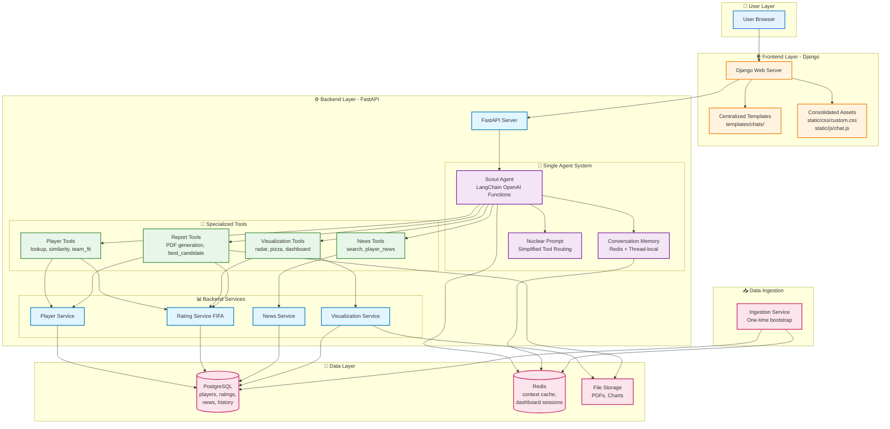
```mermaid
flowchart TB
    subgraph User_Layer["👤 User Layer"]
        User[User Browser]
    end

    subgraph Frontend_Layer["🌐 Frontend Layer - Django"]
        Web[Django Web Server]
        Templates[Centralized Templates<br/>templates/chats/]
        StaticFiles[Consolidated Assets<br/>static/css/custom.css<br/>static/js/chat.js]
    end

    subgraph Backend_Layer["⚙️ Backend Layer - FastAPI"]
        API[FastAPI Server]
        
        subgraph Agent_System["🤖 Single Agent System"]
            Agent[Scout Agent<br/>LangChain OpenAI Functions]
            Memory[Conversation Memory<br/>Redis + Thread-local]
            SystemPrompt[Nuclear Prompt<br/>Simplified Tool Routing]
        end
        
        subgraph Tools_Layer["🔧 Specialized Tools"]
            PlayerTools[Player Tools<br/>lookup, similarity, team_fit]
            NewsTools[News Tools<br/>search, player_news]
            VizTools[Visualization Tools<br/>radar, pizza, dashboard]
            ReportTools[Report Tools<br/>PDF generation, best_candidate]
        end
        
        subgraph Services_Layer["📊 Backend Services"]
            PlayerService[Player Service]
            RatingService[Rating Service FIFA]
            NewsService[News Service]
            VizService[Visualization Service]
        end
    end

    subgraph Data_Layer["💾 Data Layer"]
        Postgres[(PostgreSQL<br/>players, ratings,<br/>news, history)]
        Redis[(Redis<br/>context cache,<br/>dashboard sessions)]
        Storage[File Storage<br/>PDFs, Charts]
    end

    subgraph Ingestion_Layer["📥 Data Ingestion"]
        Ingest[Ingestion Service<br/>One-time bootstrap]
    end

    %% User interactions
    User --> Web
    Web --> Templates
    Web --> StaticFiles
    Web --> API

    %% API to Agent
    API --> Agent
    Agent --> Memory
    Agent --> SystemPrompt
    
    %% Agent to Tools
    Agent --> PlayerTools
    Agent --> NewsTools
    Agent --> VizTools
    Agent --> ReportTools
    
    %% Tools to Services
    PlayerTools --> PlayerService
    PlayerTools --> RatingService
    NewsTools --> NewsService
    VizTools --> VizService
    VizTools --> RatingService
    ReportTools --> PlayerService
    ReportTools --> RatingService
    
    %% Services to Data
    PlayerService --> Postgres
    RatingService --> Postgres
    NewsService --> Postgres
    VizService --> Postgres
    VizService --> Storage
    ReportTools --> Storage
    
    %% Context Management
    Agent --> Redis
    Memory --> Redis
    
    %% Ingestion
    Ingest --> Postgres
    Ingest --> Redis

    %% Styling
    classDef userStyle fill:#e3f2fd,stroke:#1976d2,stroke-width:2px
    classDef frontendStyle fill:#fff3e0,stroke:#f57c00,stroke-width:2px
    classDef agentStyle fill:#f3e5f5,stroke:#7b1fa2,stroke-width:2px
    classDef toolStyle fill:#e8f5e9,stroke:#388e3c,stroke-width:2px
    classDef serviceStyle fill:#e1f5fe,stroke:#0277bd,stroke-width:2px
    classDef dataStyle fill:#fce4ec,stroke:#c2185b,stroke-width:2px
    
    class User userStyle
    class Web,Templates,StaticFiles frontendStyle
    class Agent,Memory,SystemPrompt agentStyle
    class PlayerTools,NewsTools,VizTools,ReportTools toolStyle
    class PlayerService,RatingService,NewsService,VizService,API serviceStyle
    class Postgres,Redis,Storage,Ingest dataStyle
```

---

## 🧐 AI Agent Workflow (Nuclear Prompt System)

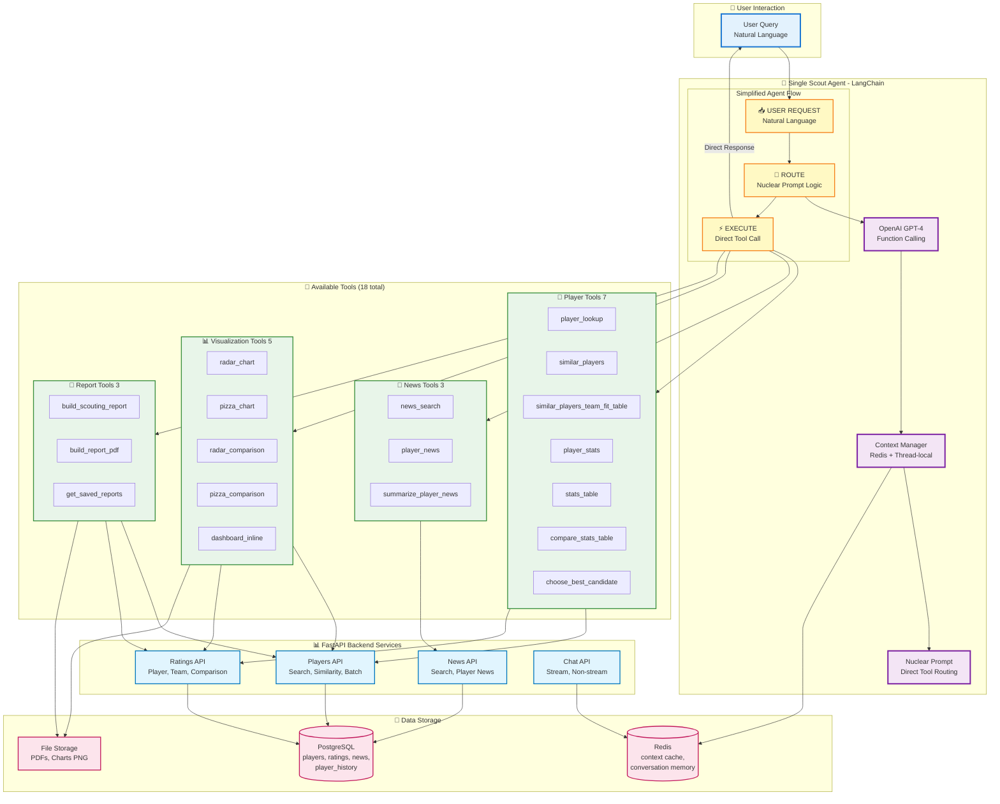
```mermaid
flowchart TB
    subgraph User_Interaction["👤 User Interaction"]
        User[User Query<br/>Natural Language]
    end

    subgraph Agent_Core["🤖 Single Scout Agent - LangChain"]
        direction TB
        
        subgraph Agent_Flow["Simplified Agent Flow"]
            Request[📥 USER REQUEST<br/>Natural Language]
            Route[🎯 ROUTE<br/>Nuclear Prompt Logic]
            Execute[⚡ EXECUTE<br/>Direct Tool Call]
        end
        
        LLM[OpenAI GPT-4<br/>Function Calling]
        ContextMgr[Context Manager<br/>Redis + Thread-local]
        SystemPrompt[Nuclear Prompt<br/>Direct Tool Routing]
    end

    subgraph Available_Tools["🔧 Available Tools (18 total)"]
        direction LR
        
        subgraph PlayerTools["👥 Player Tools 7"]
            PT1[player_lookup]
            PT2[similar_players]
            PT3[similar_players_team_fit_table]
            PT4[player_stats]
            PT5[stats_table]
            PT6[compare_stats_table]
            PT7[choose_best_candidate]
        end
        
        subgraph NewsTools["📰 News Tools 3"]
            NT1[news_search]
            NT2[player_news]
            NT3[summarize_player_news]
        end
        
        subgraph VizTools["📊 Visualization Tools 5"]
            VT1[radar_chart]
            VT2[pizza_chart]
            VT3[radar_comparison]
            VT4[pizza_comparison]
            VT5[dashboard_inline]
        end
        
        subgraph ReportTools["📄 Report Tools 3"]
            RT1[build_scouting_report]
            RT2[build_report_pdf]
            RT3[get_saved_reports]
        end
    end

    subgraph Backend_Services["📊 FastAPI Backend Services"]
        PlayersAPI[Players API<br/>Search, Similarity, Batch]
        RatingsAPI[Ratings API<br/>Player, Team, Comparison]
        NewsAPI[News API<br/>Search, Player News]
        ChatAPI[Chat API<br/>Stream, Non-stream]
    end

    subgraph Data_Storage["💾 Data Storage"]
        PostgreSQL[(PostgreSQL<br/>players, ratings, news,<br/>player_history)]
        RedisCache[(Redis<br/>context cache,<br/>conversation memory)]
        FileStorage[File Storage<br/>PDFs, Charts PNG]
    end

    %% User to Agent
    User --> Request
    Request --> Route
    Route --> LLM
    LLM --> ContextMgr
    ContextMgr --> SystemPrompt
    
    %% Simplified Flow
    Route --> Execute
    Execute -->|"Direct Response"| User
    
    %% Execute calls Tools
    Execute --> PlayerTools
    Execute --> NewsTools
    Execute --> VizTools
    Execute --> ReportTools
    
    %% Tools call Backend Services
    PlayerTools --> PlayersAPI
    PlayerTools --> RatingsAPI
    NewsTools --> NewsAPI
    VizTools --> PlayersAPI
    VizTools --> RatingsAPI
    ReportTools --> PlayersAPI
    ReportTools --> RatingsAPI
    
    %% Backend Services use Data
    PlayersAPI --> PostgreSQL
    RatingsAPI --> PostgreSQL
    NewsAPI --> PostgreSQL
    ChatAPI --> RedisCache
    
    %% File Generation
    VizTools --> FileStorage
    ReportTools --> FileStorage
    
    %% Context Persistence
    ContextMgr --> RedisCache
    
    %% Styling
    classDef userStyle fill:#e3f2fd,stroke:#1976d2,stroke-width:3px
    classDef agentStyle fill:#f3e5f5,stroke:#7b1fa2,stroke-width:3px
    classDef flowStyle fill:#fff9c4,stroke:#f57f17,stroke-width:2px
    classDef toolStyle fill:#e8f5e9,stroke:#388e3c,stroke-width:2px
    classDef serviceStyle fill:#e1f5fe,stroke:#0277bd,stroke-width:2px
    classDef dataStyle fill:#fce4ec,stroke:#c2185b,stroke-width:2px
    
    class User userStyle
    class LLM,ContextMgr,SystemPrompt agentStyle
    class Request,Route,Execute flowStyle
    class PlayerTools,NewsTools,VizTools,ReportTools toolStyle
    class PlayersAPI,RatingsAPI,NewsAPI,ChatAPI serviceStyle
    class PostgreSQL,RedisCache,FileStorage dataStyle
```

---

## 🔑 Key Architecture Points

### Single-Agent Design
- **One LangChain Agent** orchestrates all operations
- **18 specialized tools** (not independent agents)
- **Nuclear Prompt** for direct tool routing and optimal performance
- **Stateful context** persisted in Redis + Thread-local storage

### Tool Categories
1. **Player Tools (7)**: Search, similarity, stats, comparison, team fit analysis
2. **News Tools (3)**: News search, player-specific news, summarization
3. **Visualization Tools (5)**: Radar/pizza charts, comparative visualizations, dashboards
4. **Report Tools (3)**: PDF generation, candidate selection, report history

### Context Management
- **Redis-backed memory**: Conversation history and search context
- **Thread-local storage**: User-specific context isolation during requests
- **Session-based storage**: Unique dashboard data with automatic cleanup
- **Context persistence**: Robust user context management preventing data mixing

### NOT Multi-Agent
- Single agent with multiple tools (not autonomous sub-agents)
- No agent-to-agent communication or coordination
- Simpler than multi-agent but still highly capable

---

## 🐳 Docker Services

The project is composed of several Docker containers:

| Service | Purpose | Ports |
|---------|---------|-------|
| **api** | FastAPI backend + AI agent | 8001 |
| **web** | Django frontend | 8000 |
| **db** | PostgreSQL database | 5432 (internal) |
| **redis** | Cache + context memory | 6379 (internal) |
| **jupyter** | Jupyter Lab for development | 8888 |
| **ingestion** | One-time data loading | N/A (ephemeral) |

---

# 📖 User Guide

## 🔍 Manual Player Search

### Access
Navigate to [https://localhost:8000/dashboard/search/](https://localhost:8000/dashboard/search/)

### Features
- **Search by name** with real-time filtering
- **Advanced filters**: Position, age range, league, club, nationality, minutes
- **Compare up to 3 players** with radar charts
- **Historical evolution charts** (minutes + 2 position metrics)
- **Categorized metrics sidebar**: Usage, Attacking, Per 90, Progression, Passing, Defending, Goalkeeping
- **Save search configurations** for reuse
- **Export data** for further analysis

### Example Workflow
1. Enter player name (e.g., "Pedri")
2. Apply filters (Position: MF, Age: 18-25, League: La Liga)
3. Select up to 3 players for comparison
4. View radar chart and historical evolution
5. Save search as "Young Spanish Midfielders"

---

## 🤖 AI Agent Chat

### Access
Navigate to [https://localhost:8000/chat/](https://localhost:8000/chat/)

### Example Prompts

| Prompt | Expected Output |
|--------|----------------|
| "Find midfielders similar to Pedri under 25 years old" | List of candidates with Success Index v2.1 |
| "Create a radar chart for Florian Wirtz" | Radar chart image with 6 attributes |
| "Generate a comparison table between Jamal Musiala and Jude Bellingham" | HTML stats table with key metrics |
| "What are the latest news about Arda Güler?" | Recent news summaries with links |
| "Generate a PDF report for left-backs similar to Alphonso Davies" | Download link to scouting report |
| "Compare the top 3 similar players to Pedri for Real Madrid" | Comparison radar + team fit analysis |

### Agent Transparency
Watch real-time agent execution:
- 📥 **Request**: Agent receives your query
- 🎯 **Routing**: Nuclear prompt determines optimal tool
- 🔍 **Executing**: Direct tool execution (search, analyze, create)
- 📊 **Processing**: Generating visualizations and reports
- ✅ **Complete**: Final response delivered

### Language Support
The agent responds in the same language you use. Write prompts in English or Spanish.

---

## 📊 Player Profile Pages

### Access
Click on any player name in search results or agent recommendations.

### Information Displayed
- **Personal Info**: Name, age, nationality, position, club, league
- **FIFA-Style Rating Card**: OVR + 6 attributes (ATT, PLY, DEF, CTR, PHY, GKP)
- **Season Stats**: Complete statistics for current season
- **Radar Chart**: Visual representation of player strengths
- **Historical Evolution**: Performance trends over multiple seasons
- **Similar Players**: Top 5 most similar players
- **Latest News**: Recent articles mentioning the player

---

## 📄 PDF Reports

### Features
- **Professional Layout**: Clean, structured format
- **Player Summary**: Key stats and ratings
- **Success Index Breakdown**: Detailed scoring explanation
- **Viability Score**: Transfer feasibility assessment
- **Visual Profile Badges**: 🟢🟡🟠🔴 indicators
- **Recommendation**: AI's final suggested candidate
- **Comparison Table**: Top candidates ranked by viability

### Access
- Request via AI agent: *"Generate a PDF report for..."*
- Download from User Reports page: [https://localhost:8000/chat/](https://localhost:8000/chat/)

---

## 📸 Screenshots

### Home Page
<p align="center">
  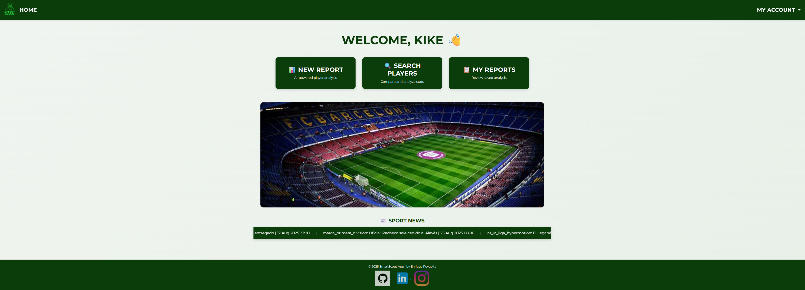
</p>

### User Profile Page
<p align="center">
  
</p>

### User Reports Page
<p align="center">
  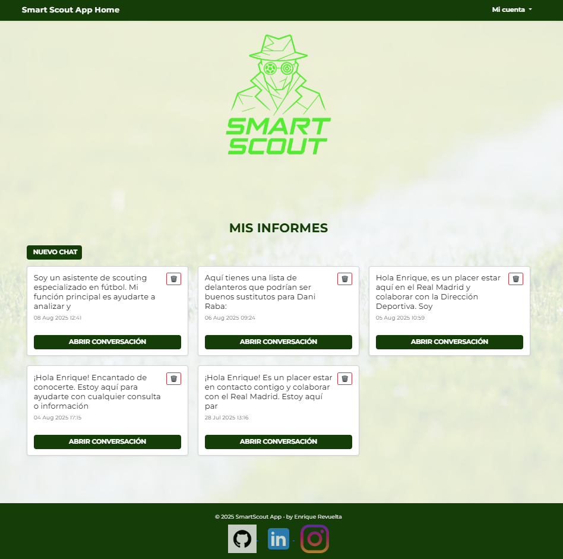
</p>

### Manual Search Dashboard
<p align="center">
  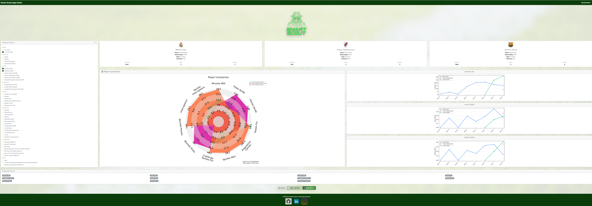
</p>

### Player Profile Dashboard
<p align="center">
  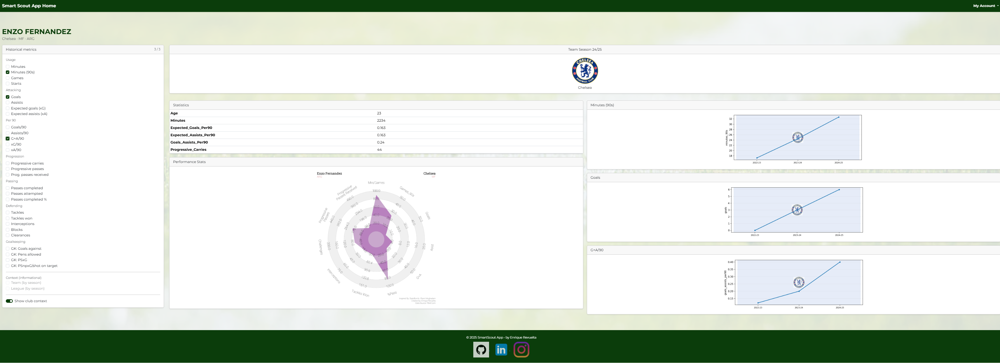
</p>

### Interactive Dashboard
<p align="center">
  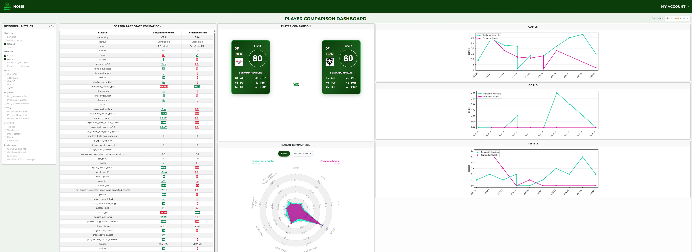
</p>

### Radar Chart Example
<p align="center">
  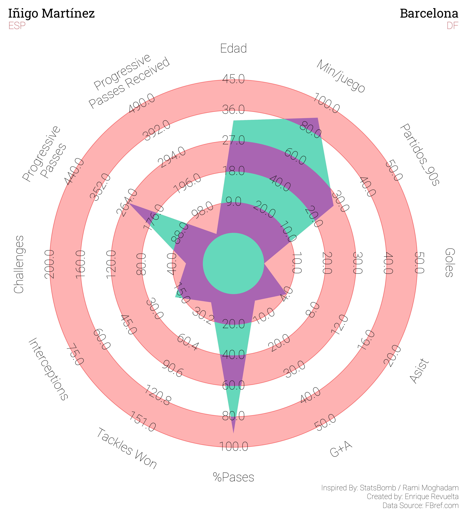
</p>

### Radar Comparison Example
<p align="center">
  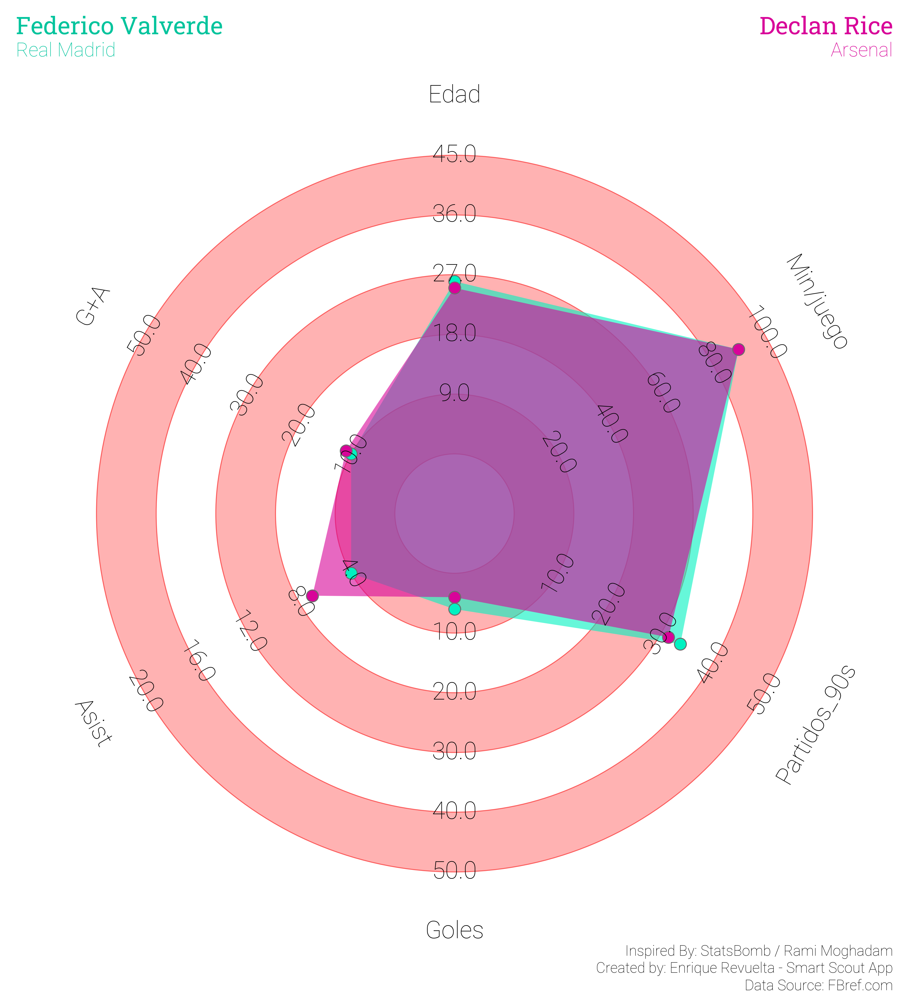
</p>

### Pizza Chart Example
<p align="center">
  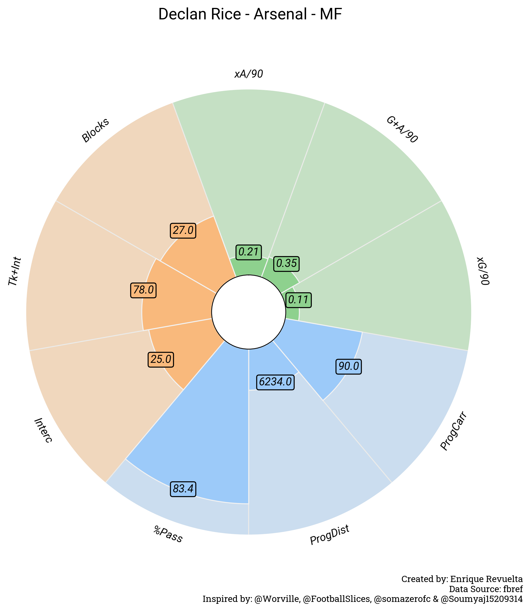
</p>

### Pizza Comparison Example
<p align="center">
  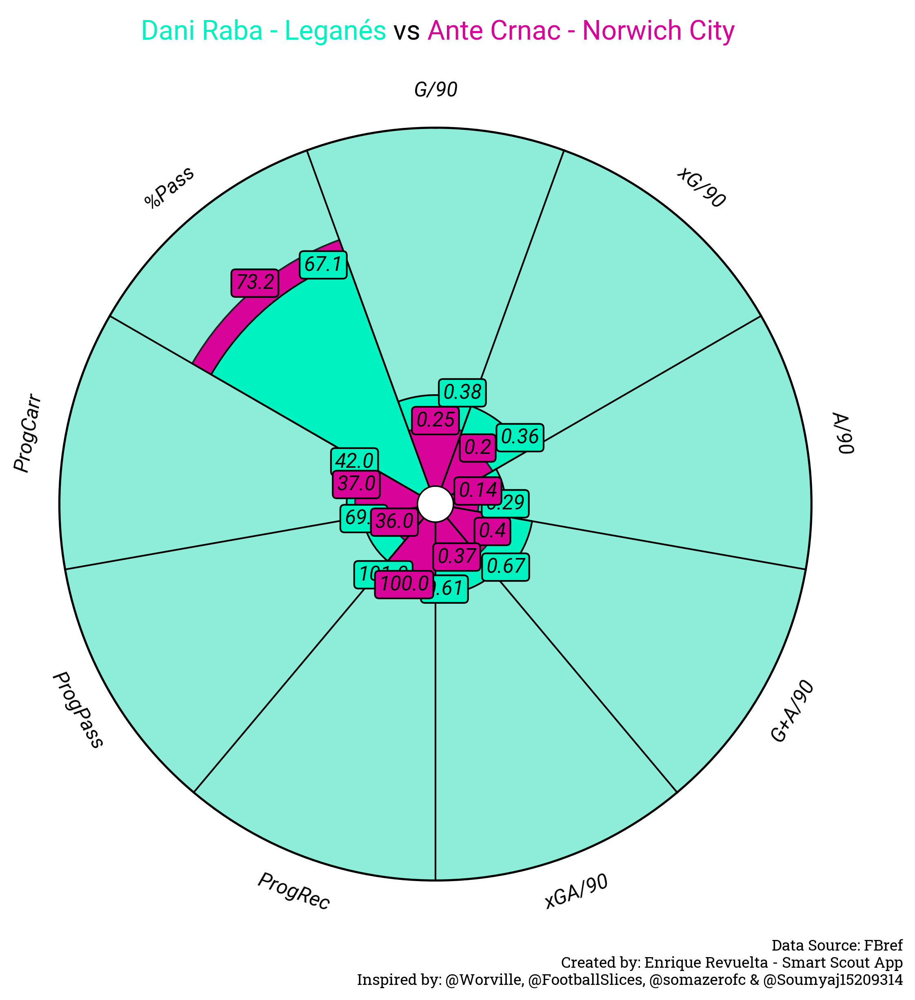
</p>

---

# 👨‍💻 Developer Guide

## 📁 Project Structure

```
smart_scout_app/
├── apps/
│   ├── agent_service/        # AI agent + tools
│   │   ├── routers/          # FastAPI endpoints
│   │   ├── tools/            # LangChain tools (18 total)
│   │   └── viz_tools.py      # Chart generation
│   ├── dashboard/            # Django frontend
│   │   ├── views.py          # View controllers
│   │   ├── templates/        # HTML templates
│   │   └── static/           # CSS/JS/images
│   ├── ingestion/            # Data loading scripts
│   │   └── seed_and_ingest.py
│   └── rating_system/        # FIFA rating calculator
│       └── calculator.py
├── data/                     # CSV datasets
│   ├── all_players_plus_historic_data_aggregated_v2.csv
│   └── all_players_plus_historic_data_non_aggregated_v2.csv
├── notebooks/                # Jupyter notebooks
│   └── scrapper/            # Data scraping scripts
│       └── aggregate_final.py
├── scripts/                  # Utility scripts
│   ├── calculate_ratings_to_csv.py  # Optimized rating calculation (v1.6)
│   ├── calculate_all_ratings.py     # Legacy rating calculation
│   └── audit_team_ratings.py
├── tests/                    # Test suite
│   ├── unit/                # Unit tests
│   └── api/                 # API tests
├── docker-compose.yml        # Docker services
├── Makefile                 # Common commands
└── README.md                # This file
```

---

## 🔧 Environment Variables

### Required API Keys
```bash
# OpenAI (for AI agent)
OPENAI_API_KEY=sk-...

# Langfuse (for LLM observability - optional)
LANGFUSE_PUBLIC_KEY=pk-...
LANGFUSE_SECRET_KEY=sk-...
LANGFUSE_HOST=https://cloud.langfuse.com
LANGFUSE_ENABLED=true

# Database
DATABASE_URL=postgresql+psycopg2://scout:scout@db:5432/scouting

# Redis
REDIS_URL=redis://redis:6379/0

# Django
SECRET_KEY=your-secret-key-here
DEBUG=True
ALLOWED_HOSTS=localhost,127.0.0.1
```

### Setup
```bash
cp .env.example .env
# Edit .env with your API keys
```

### LLM Observability with Langfuse (v1.6)

Smart Scout App v1.6 includes comprehensive LLM observability through Langfuse integration:

#### Features
- **Real-time Cost Tracking**: Monitor token usage and costs per conversation
- **Performance Monitoring**: Track latency and response times
- **Quality Assessment**: Analyze conversation success rates
- **Production Insights**: Make data-driven scaling decisions

#### Setup
1. **Register at [Langfuse](https://cloud.langfuse.com)** (free tier available)
2. **Get API Keys**: Copy your public and secret keys from the dashboard
3. **Configure Environment**: Add keys to your `.env` file (see above)
4. **Restart Services**: `docker-compose restart api web`

#### Usage
- **Automatic Tracking**: All LLM calls are automatically tracked
- **Dashboard Access**: View detailed analytics at [cloud.langfuse.com](https://cloud.langfuse.com)
- **Cost Analysis**: Monitor daily/monthly costs and optimize usage
- **Performance Tuning**: Identify slow queries and optimize agent responses

#### Example Metrics
- **Player Search**: ~$0.016 per query (6,175 tokens)
- **Dashboard Generation**: ~$0.008 per dashboard (2,987 tokens)
- **PDF Report**: ~$0.043 per report (14,685 tokens)

---

## ⚙️ Makefile Commands

| Command | Description |
|---------|-------------|
| `make up` | Build + start all services (api, web, db, redis, jupyter) |
| `make build` | Build Docker images only |
| `make up-db` | Start only PostgreSQL + Redis |
| `make ingest-full` | Full bootstrap (players + history + ratings + news) |
| `make ingest-players` | Players + history + ratings (no news) |
| `make ingest-news` | Fetch only new news articles |
| `make stop` | Stop containers, keep data |
| `make down` | Remove containers, keep volumes |
| `make down-all` | ⚠️ Remove everything (deletes DB) |
| `make restart` | Down + up |
| `make prune` | Aggressive Docker cleanup |
| `make clean` | Prune + fresh build |

---

## 📦 Data Management

### Data Update Process

```bash
# 1. Update raw data (when new season available)
python scripts/update_data.py --season 2025-26

# 2. Aggregate and disambiguate players
python notebooks/scrapper/aggregate_final.py

# 3. Ingest aggregated data to players table
python -m apps.ingestion.seed_and_ingest \
  --players-csv data/all_players_plus_historic_data_aggregated_v3.csv \
  --replace --verbose --refresh-embs

# 4. Ingest historical data to player_history table
python -m apps.ingestion.seed_and_ingest \
  --history-csv data/all_players_plus_historic_data_non_aggregated_v3.csv \
  --replace-history --verbose

# 5. Generate and ingest FIFA-style ratings (v1.6 optimized)
python scripts/calculate_ratings_to_csv.py
python -m apps.ingestion.seed_and_ingest \
  --ratings-csv data/player_ratings.csv --replace-ratings --verbose
```

### CLI Flags Reference

| Flag | Purpose |
|------|---------|
| `--players-csv PATH` | CSV with raw player stats |
| `--history-csv PATH` | CSV with seasonal records |
| `--ratings-csv PATH` | CSV with pre-calculated ratings (v1.6) |
| `--news-csv PATH` | CSV with football news for bootstrap import (uses embedding from CSV if present) |
| `--replace` | Truncate `players` and `player_news` before inserting |
| `--replace-history` | Truncate `player_history` before inserting |
| `--replace-ratings` | Truncate `player_ratings` before inserting |
| `--replace-news` | Truncate `football_news` before inserting from CSV |
| `--refresh-embs` | Recompute every `feature_vector` with StandardScaler + pgvector |
| `--ingest-news` | Fetch, summarize, embed and upsert RSS news |
| `--skip-players` | Skip player ingestion (news-only run) |
| `--echo-sql` | Verbose SQL for debugging |
| `--verbose` | Detailed logging |

**Note**: `--calculate-ratings` flag has been replaced with `--ratings-csv` for better performance and reliability.

#### News CSV Bootstrap Examples
```bash
# Export current news (with embeddings) to CSV
python scripts/export_news_to_csv.py --out data/news_export.csv

# Import news from CSV (uses embeddings from CSV if present)
python -m apps.ingestion.seed_and_ingest \
  --news-csv data/news_export.csv \
  --replace-news \
  --verbose
```

---

## 🧪 Testing

### Test Suite Overview
- ✅ **63 Passing Tests** (100% success rate)
- **Unit Tests**: 44 tests (Models, Validation)
- **API Tests**: 19 tests (FastAPI endpoints)
- **Coverage**: >80% for critical components

### Running Tests

```bash
# Run all tests
docker-compose exec api python -m pytest tests/ -v

# Run specific categories
docker-compose exec api python -m pytest tests/unit/ -v       # Unit tests
docker-compose exec api python -m pytest tests/api/ -v        # API tests

# Run with coverage
docker-compose exec api python -m pytest tests/ --cov=. --cov-report=html

# Run specific test file
docker-compose exec api python -m pytest tests/unit/test_validation.py -v

# Debug mode (verbose + output)
docker-compose exec api python -m pytest tests/ -v -s
```

### Test Categories

#### 🔍 Data Quality Tests (27 tests)
- Player data validation
- News data validation
- Parameter validation
- Age range validation

#### 🌐 API Tests (19 tests)
- Endpoint availability
- Error handling (404, 422, 500)
- OpenAPI documentation

#### 🎨 Model Tests (17 tests)
- Django model structure
- Field validation
- Relationships

### Test Coverage
- **Validation Functions**: >95%
- **API Endpoints**: >80%
- **Django Models**: >85%
- **Overall Target**: >80%

---

## 🛠️ Development Workflow

### 1. Local Development
```bash
# Start services
make up

# Watch logs
docker-compose logs -f api
docker-compose logs -f web

# Access shell
docker-compose exec api bash
docker-compose exec web bash

# Run Jupyter for testing
# Navigate to http://localhost:8888
```

### 2. Making Code Changes
```bash
# Edit files locally
vim apps/agent_service/tools/player_tools.py

# Restart services to pick up changes
make restart

# Or restart individual service
docker-compose restart api
```

### 3. Database Migrations
```bash
# Create migration
docker-compose exec web python manage.py makemigrations

# Apply migration
docker-compose exec web python manage.py migrate

# Rollback migration
docker-compose exec web python manage.py migrate app_name migration_name
```

### 4. Testing Changes
```bash
# Run tests
docker-compose exec api python -m pytest tests/ -v

# Test specific endpoint
curl http://localhost:8001/players/1/similar_team_fit?team=Real%20Madrid

# Test AI agent
# Navigate to http://localhost:8000/chat/
```

---

## 📊 Database Schema

### Key Tables

#### `players`
Aggregated player profiles for similarity search.
- `id`: Primary key
- `full_name`: Player name
- `position`: Main position (GK, DF, MF, FW)
- `club`: Current club
- `league`: Current league
- `age`, `nationality`, `minutes_played`
- Stats columns (goals, assists, tackles, etc.)
- `feature_vector`: 43-D embedding for similarity

#### `player_history`
Seasonal records for evolution tracking.
- `id`: Primary key
- `player_name`: Player name
- `season`: Season (e.g., "2024-25")
- `club`, `league`, `position`
- All stats columns

#### `player_ratings`
FIFA-style ratings calculated from stats.
- `id`: Primary key
- `player_id`: Foreign key to `players`
- `season`: Season
- `overall_rating`: OVR (0-100)
- `league_base_rating`: League quality tier
- `performance_rating`: Performance component
- `att`, `ply`, `def_rating`, `ctr`, `phy`, `gkp`: Attributes
- `minutes_played`: Minutes threshold

#### `player_news`
News articles about players.
- `id`: Primary key
- `title`, `summary`, `url`
- `published_date`
- `embedding`: Vector for semantic search

---

## 🔌 API Endpoints Reference

### Players
- `GET /players/search` - Search players by name
- `GET /players/{id}` - Get player details
- `GET /players/{id}/similar` - Find similar players
- `GET /players/{id}/similar_team_fit` - Team fit analysis
- `POST /players/batch` - Batch player lookup

### Ratings
- `GET /api/ratings/player/{id}` - Get player rating
- `GET /api/ratings/team/{name}` - Get team rating
- `GET /api/ratings/comparison/{id1}/{id2}/radar` - Comparison radar
- `GET /api/ratings/top` - Top players by rating
- `GET /api/ratings/leagues` - Available leagues
- `GET /api/ratings/nationalities` - Available nationalities

### News
- `GET /news/search` - Semantic news search
- `GET /news/player/{id}` - Player-specific news

### Chat
- `POST /chat/stream` - Streaming chat with AI agent
- `POST /chat/` - Non-streaming chat

### Interactive API Documentation
Navigate to [http://localhost:8001/docs](http://localhost:8001/docs) for Swagger UI with all endpoints.

---

## 🐛 Troubleshooting

### Common Issues

#### Port Already in Use
```bash
# Stop conflicting services
docker-compose down
sudo lsof -ti:8000 | xargs kill -9   # Kill Django
sudo lsof -ti:8001 | xargs kill -9   # Kill FastAPI

# Restart
make up
```

#### Database Connection Errors
```bash
# Check if db is running
docker-compose ps

# Restart db
docker-compose restart db

# Check logs
docker-compose logs db
```

#### Missing Dependencies
```bash
# Rebuild with fresh install
docker-compose build --no-cache api web

# Or install manually
docker-compose exec --user root api uv pip install --system <package>
```

#### Context Loss in Agent
```bash
# Check Redis
docker-compose exec redis redis-cli PING

# Restart Redis
docker-compose restart redis

# Check logs
docker-compose logs -f api | grep "CONTEXT"
```

#### Logout Not Working in Production
```bash
# Symptom: Logout button doesn't work when accessed from secondary domain
# Cause: Missing domain in CSRF_TRUSTED_ORIGINS

# Solution: Add all production domains to .env
CSRF_TRUSTED_ORIGINS=https://domain1.aws.bain.dev,https://domain2.aws.bain.dev

# Verify current settings
docker exec app printenv | grep CSRF_TRUSTED_ORIGINS

# Restart containers
docker restart app

# Also recommended for production:
DEBUG=false
SESSION_COOKIE_SECURE=true
CSRF_COOKIE_SECURE=true
```

#### Test Failures
```bash
# Install test dependencies
docker-compose exec --user root api uv pip install --system pytest pytest-django pytest-cov pytest-mock pytest-asyncio factory-boy faker httpx coverage

# Run specific test with debug
docker-compose exec api python -m pytest tests/unit/test_validation.py::TestPlayerDataValidation::test_validate_player_data_valid -v -s
```

---

## 📚 Code Quality

### Standards
- **Language**: All code, comments, and docstrings in English
- **Style**: PEP 8 for Python, ESLint for JavaScript
- **Type Hints**: Use type annotations for Python functions
- **Documentation**: Docstrings for all public functions/classes
- **Testing**: Write tests for new features (target >80% coverage)

### Best Practices
- ✅ Use meaningful variable names
- ✅ Keep functions small and focused
- ✅ Avoid deep nesting (max 3 levels)
- ✅ Handle errors gracefully
- ✅ Log important events
- ✅ Validate user inputs
- ✅ Sanitize database queries (use ORMs)
- ✅ Cache expensive operations
- ✅ Use async/await for I/O operations

---

# 🚀 Version Releases

## 📦 Current Release: v1.6.3 (November 2025)

### 🐛 Bug Fixes & Production Improvements

**Responsive UI Fix:**
- ✅ **Player Search Grid Layout**: Fixed pagination buttons overlapping with action buttons on small screens
- ✅ **CSS Grid Implementation**: Added responsive grid to `main-header` div for better mobile/tablet experience
- ✅ **Media Queries**: Breakpoints at 992px (tablet) and 576px (mobile) for optimal layout adaptation
- ✅ **Button Stacking**: Action buttons now stack properly on small screens preventing overlap

**Production Issues Documented:**
- ✅ **CSRF Logout Issue**: Identified and documented logout failure when `CSRF_TRUSTED_ORIGINS` missing secondary domains
- ✅ **Configuration Guide**: Added troubleshooting section for common production authentication issues
- ✅ **Multi-Domain Setup**: Documented requirement for all production domains in environment variables

### 🔧 Technical Details
- **Modified Files**: `templates/dashboard/player_search.html` (HTML structure + CSS Grid)
- **Grid Layout**: 3-column desktop → 2-column tablet → 1-column mobile
- **Browser Compatibility**: Tested on Chrome, Firefox, Safari, Edge
- **Production Fix**: Added all domains to `CSRF_TRUSTED_ORIGINS` environment variable

---

## 📦 Previous Release: v1.6.1 (October 2025)

### 🔧 Infrastructure & Developer Experience Improvements

**Frontend Refactoring:**
- ✅ **CSS Consolidation**: All styles unified in `static/css/custom.css` for better maintainability
- ✅ **Template Centralization**: HTML templates moved to `templates/chats/` directory
- ✅ **JavaScript Organization**: Chat functionality centralized in `static/js/chat.js`
- ✅ **Responsive Design**: Improved chat layout with centered containers and consistent backgrounds
- ✅ **Clean Architecture**: Removed duplicate/obsolete files for cleaner codebase

**Agent Context Management:**
- ✅ **Nuclear Prompt Optimization**: Drastically simplified system prompt for better tool routing
- ✅ **Thread-Local User Context**: Robust user ID management preventing context mixing
- ✅ **Unique Dashboard URLs**: Each dashboard now generates unique URLs preventing overwrites
- ✅ **Session-Based Storage**: Dashboard data stored in Django sessions with automatic cleanup
- ✅ **Context Persistence**: Fixed agent context management across conversational turns

**Development Workflow:**
- ✅ **Makefile Enhancement**: Added `make stop-core` command for core services management
- ✅ **Cost Optimization**: ~80% reduction in LLM token usage through prompt optimization
- ✅ **Git Workflow**: Improved branch management and deployment process
- ✅ **Code Quality**: All comments and documentation in English for consistency

### 🎯 Benefits Achieved
- **⚡ Performance**: Faster agent routing and response times
- **💰 Cost Efficiency**: Significant reduction in LLM token usage
- **🔧 Maintainability**: Cleaner, more organized codebase structure
- **🛡️ Reliability**: Robust context management preventing user data mixing
- **📱 User Experience**: Improved chat interface and responsive design

### 🔍 Technical Highlights
- **Agent Prompt**: From 150+ lines to minimal nuclear prompt
- **CSS Lines**: Organized ~3000 lines into structured sections
- **Dashboard System**: Unique ID-based URLs with session cleanup
- **Context Management**: Thread-local storage + Redis persistence
- **File Structure**: Centralized templates and static assets

---

# 📋 Release Notes

## 🚀 Version 1.6 - FIFA-Style Ratings & Player Disambiguation (October 2025)

### ✨ New Features
- **FIFA-Style Rating System**: Comprehensive 0-100 player evaluation across 6 attributes
  - ATT (Attacking), PLY (Playmaking), DEF (Defending), CTR (Control), PHY (Physical), GKP (Goalkeeping)
  - Position-specific attribute weighting (GK, DF, MF, FW)
  - Overall Rating = 60% League Base + 40% Performance
  - Confidence factors based on minutes played (regression to league mean)
  
- **Enhanced PHY & GKP Calculations**:
  - PHY = (League Base + Performance) / 2
  - GKP = (League Base + Performance) / 2 with special 1100-minute blending
  - Ensures realistic ratings across different league tiers
  - Top league players have appropriately higher baseline ratings

- **Team Rating System** (Position-Weighted):
  - Position-specific weights per attribute (ATT: 60% FW, 30% MF, 10% DF)
  - DEF includes 5% contribution from goalkeepers
  - PHY equally weighted across all outfield positions (33% each)
  - Minute-weighted within each position group
  - Example: Real Madrid OVR 83.1, ATT 74, CTR 87, GKP 67

- **FIFA-Style Visual Cards**:
  - Player cards with OVR, position, nationality, club, and 6 attributes
  - Team cards with overall and team-level metrics
  - Integrated in player profiles and comparison dashboards
  - App's green color palette for modern look

- **Player Disambiguation System**:
  - `player_uid` = name + birth_year for unique identification
  - Calculated birth_year from age and season
  - Reduced duplicates from 27,877 to 23,716 unique players

- **Intelligent Search Logic**:
  - Automatic `exclude_club` parameter when searching "for [team]"
  - Prevents showing players already on the target team
  - Example: "similar to Pedri for Real Madrid" automatically excludes Real Madrid players

- **Enhanced Language Detection**:
  - Dynamic language detection from current user message (not conversation history)
  - Response headers adapt to user language:
    - English: "🧠 Reasoning", "📊 Results", "✅ Conclusion"
    - Spanish: "🧠 Razonamiento", "📊 Resultados", "✅ Conclusión"
  - Seamless language switching within conversations

- **LLM Observability with Langfuse**:
  - Real-time cost tracking and performance monitoring
  - Token usage analysis per conversation
  - Latency monitoring for optimization
  - Production-ready observability for scaling decisions

### 🔧 Improvements
- **Data Quality**: Improved player identification prevents same-name conflicts (e.g., 2 different "Rodri" players)
- **Rating Accuracy**: League-based baselines ensure fair cross-league comparisons
- **Team Metrics**: Position-weighted team ratings reflect tactical roles (forwards dominate ATT, defenders lead DEF)
- **Visual Consistency**: Unified color schemes across all rating displays
- **Search Intelligence**: Automatic exclusion of target team players in similarity searches
- **Language Experience**: Consistent language detection and response formatting
- **Production Monitoring**: Comprehensive LLM usage tracking for cost optimization
- **Historical Charts**: Fixed choppy/interrupted historical charts by ensuring `player_uid` is always used for accurate player disambiguation

### ⚡ Rating System Performance Optimization (v1.6)
- **95% Performance Improvement**: Reduced calculation time from 18-19 minutes to <1 minute
- **CSV-based Architecture**: Generate ratings to CSV file, then ingest via `df.to_sql()` for reliability
- **Single Query Optimization**: Load all player data in one database query instead of individual lookups
- **In-memory Processing**: Pre-calculate league averages and percentiles for each (league, position) combination
- **Robust Data Validation**: Safe type casting with fallbacks for all statistical columns
- **Complete Player Coverage**: Include all players regardless of minutes played (0+ minutes)
- **Minute-based Attribute Penalties**: Realistic rating adjustments based on playing time:
  - ≥1500 min: 100% (no penalty)
  - 1200-1499 min: 95% penalty
  - 900-1199 min: 90% penalty
  - 600-899 min: 85% penalty
  - 300-599 min: 80% penalty
  - 100-299 min: 75% penalty
  - <100 min: 70% penalty
- **GKP Attribute Correction**: Non-goalkeepers now correctly receive 0 GKP instead of inflated values

### 📊 Technical Details
- **Rating Calculator**: `scripts/calculate_ratings_to_csv.py` with optimized CSV-based approach
- **Performance**: Reduced calculation time from 18-19 minutes to <1 minute
- **Minute-based Penalties**: Individual attribute penalties (ATT, PLY, DEF, CTR, PHY, GKP) based on playing time
- **Data Validation**: Robust type casting for all statistical columns with safe fallbacks
- **API Endpoints**: 
  - `/api/ratings/player/{id}` - Get player ratings
  - `/api/ratings/team/{name}` - Get team ratings
  - `/api/ratings/comparison/{id1}/{id2}/radar` - Comparison radar with ratings
- **Database**: `player_ratings` table with OVR, ATT, PLY, DEF, CTR, PHY, GKP
- **Aggregation Script**: `notebooks/scrapper/aggregate_final.py` for player disambiguation
- **Agent Intelligence**: `apps/agent_service/agents/factory.py` with dynamic language detection
- **Observability**: Langfuse integration for LLM cost and performance tracking
- **Search Logic**: Enhanced `similar_players_team_fit_table` with automatic `exclude_club` parameter

### 🎯 Benefits
- ✅ Instant player evaluation with FIFA-familiar metrics
- ✅ Fair comparisons across different leagues
- ✅ Team-level squad analysis capabilities
- ✅ No more duplicate player confusion
- ✅ Historical rating tracking ready
- ✅ Intelligent search results (no target team players in recommendations)
- ✅ Seamless multilingual experience with dynamic language detection
- ✅ Production-ready cost monitoring and optimization insights
- ✅ **Optimized performance**: 95% faster rating calculation (<1 minute vs 18-19 minutes)
- ✅ **Realistic ratings**: Minute-based penalties prevent inflated ratings for low-minute players
- ✅ **Complete coverage**: All players included regardless of playing time
- ✅ **Robust data handling**: Safe type validation prevents calculation errors

---

## 🚀 Version 1.5 - TAO Agent Transparency & Context Persistence (October 2025)

### ✨ New Features
- **TAO (Think-Action-Observation) Framework**: Real-time transparency into AI agent decision-making
  - Live streaming of agent actions during execution (tool selection, data retrieval, report generation)
  - Server-Sent Events (SSE) implementation for instant feedback
  - Custom LangChain callbacks to capture and emit agent events
  - Standardized English messages for tool execution status
  - Visual indicators in chat interface (🔍 🧠 ⚽ 📊 📄 ✅)

### 🔧 Improvements
- **Thread-Local Context Management**: Robust user context persistence across requests
  - Thread-local storage for user_id to ensure context isolation
  - Automatic fallback to Redis when tools don't receive explicit user_id
  - Fixed context loss bug when requesting dashboards/reports after new searches
  - Enhanced debug logging for troubleshooting (THREAD, REDIS, DASHBOARD)
- **Enhanced Chat Interface**: Profile pictures and improved message layout
  - User initials avatar on the left of messages
  - App logo avatar for agent responses on the right
  - Auto-scroll to latest message with smooth animation
  - Better spacing for dashboard and report buttons

### 🐛 Bug Fixes
- Fixed context retrieval for dashboard_inline and build_scouting_report tools
- Resolved issue where agent would return previous search results instead of generating new artifacts
- Fixed Redis key storage to use actual user_id instead of literal "user_id" string
- Corrected table rendering when similar_players_team_fit_table has return_direct=False

### 🔬 Technical Details
- **Backend**: Django SSE streaming with threading.Thread for async agent execution
- **Frontend**: JavaScript fetch API with ReadableStream for SSE consumption
- **Agent**: Modified LangChain agent with TAOCallback for event interception
- **Context**: Redis + in-memory cache with thread-local fallback mechanism

---

## 🚀 Version 1.4 - Extended Historical Data & Enhanced Database (October 2025)

### ✨ New Features
- **Extended Historical Coverage**: Complete player data from 2014-2025 (11 seasons)
- **Dual Database Structure**: 
  - `players` table: 46,000+ aggregated players for similarity search
  - `player_history` table: 131,000+ seasonal records for evolution tracking
- **Enhanced Data Pipeline**: Robust scraping and aggregation system for historical data
- **Improved seed_and_ingest.py**: New CLI flags for historical data management
- **Future-Ready Evolution Charts**: Database structure prepared for player dashboard historical visualizations

### 🔧 Improvements
- **Data Quality**: 10 years of historical data from Top 5 European leagues
- **Player Coverage**: 46,000+ unique players (active + historical)
- **Seasonal Records**: 131,000+ individual season records for detailed analysis
- **Robust Scraping**: Enhanced error handling and data persistence
- **Column Alignment**: Automatic handling of different column sets across seasons

### 🛠️ Technical Enhancements
- **New Database Model**: `PlayerHistory` for seasonal data storage
- **Enhanced CLI**: `--history-csv` and `--replace-history` flags
- **Data Aggregation**: Weighted averages by minutes played for player profiles
- **File Management**: Organized data structure with separate aggregated and raw datasets

---

## 🚀 Version 1.3 - Viability Score & Enhanced Recommendations (October 2025)

### ✨ New Features
- **Viability Score System**: New final ranking metric that combines Success Index v2.1 with transfer feasibility
- **Feasibility Multipliers**: Intelligent transfer difficulty assessment based on club rivalry, player status, and market value
- **Enhanced Recommendation Table**: Added Viability Score column with visual indicators and sorting capabilities
- **Intelligent AI Selection**: Agent now reasons about the most viable signing option, not just the highest-scored one
- **Rivalry Matrix**: Automatic detection and penalization of impossible transfers between rival clubs

### 🔧 Improvements
- **Cache Persistence**: Fixed context loss between agent calls with dual cache system
- **PDF Report Generation**: Cleaned HTML rendering and improved Success Index v2.1 integration
- **Feasibility Multipliers**: Adjusted weights for more realistic Top 5 league player recommendations
- **Debug Logging**: Added comprehensive logging for better troubleshooting
- **Table Interactivity**: Enhanced sorting and copy functionality for recommendation tables

---

## 🚀 Version 1.2 - Success Index v2.1 (September 2025)

### ✨ New Features
- **Success Index v2.1**: Advanced scoring system considering league quality, playing time, age, team strength, and position-specific adjustments
- **Visual Profile Badges**: 🟢🟡🟠🔴 indicators for quick candidate assessment
- **Interactive HTML Tables**: Sortable, copyable recommendation tables with detailed breakdowns
- **Position Adjustments**: Specialized bonuses for GK, FW, DF, MF based on performance thresholds
- **Team Strength Calculation**: Dynamic team scoring based on aggregated player metrics

---

## 🚀 Version 1.1 - Foundation Release (September 2025)

### Core Functionality
- ✅ AI-powered scouting agent with natural language queries
- ✅ Manual player search with advanced filtering
- ✅ Data visualization (radar charts, pizza charts, dashboards)
- ✅ News integration with AI-powered summarization
- ✅ PDF report generation

### Technical Features
- ✅ Multi-language support (English/Spanish)
- ✅ Responsive design (desktop/tablet/mobile)
- ✅ Docker containerization
- ✅ Real-time search and filtering
- ✅ Semantic search with pgvector

---

# 📞 Support & Contributing

## 🆘 Getting Help
- **Documentation**: This README covers most use cases
- **API Docs**: [http://localhost:8001/docs](http://localhost:8001/docs) for interactive API exploration
- **Issues**: Create an issue in the repository for bugs or feature requests

## 🤝 Contributing
Contributions are welcome! Please follow these guidelines:
1. Fork the repository
2. Create a feature branch (`git checkout -b feature/amazing-feature`)
3. Write tests for new functionality
4. Ensure all tests pass (`make test`)
5. Commit with clear messages (`git commit -m 'Add amazing feature'`)
6. Push to your fork (`git push origin feature/amazing-feature`)
7. Create a Pull Request

## 📜 License
This project is proprietary. All rights reserved.

---

<p align="center">
  <strong>Smart Scout App v1.6.3</strong><br/>
  Empowering football teams with intelligent player scouting technology
</p>

<p align="center">
  Made with ❤️ for football analytics
</p>


