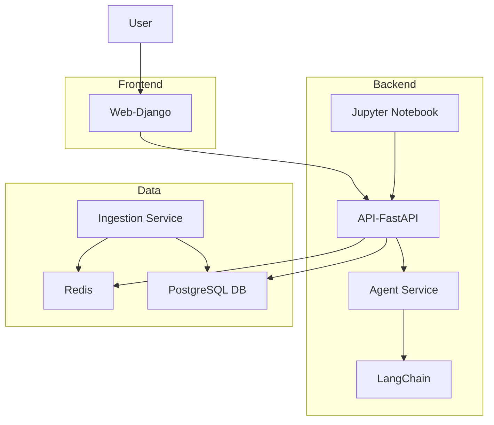
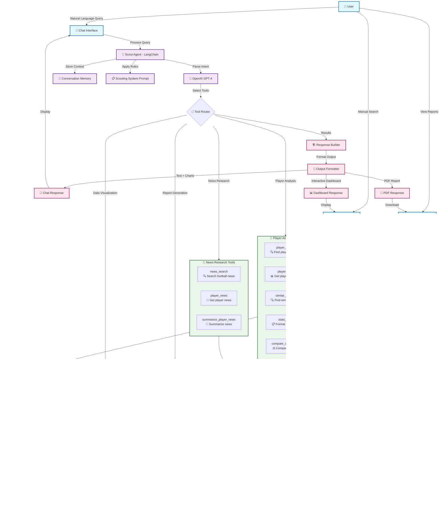
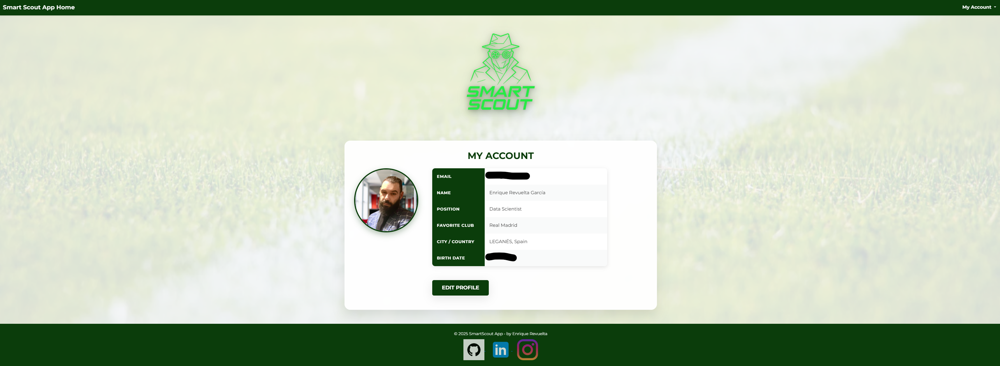
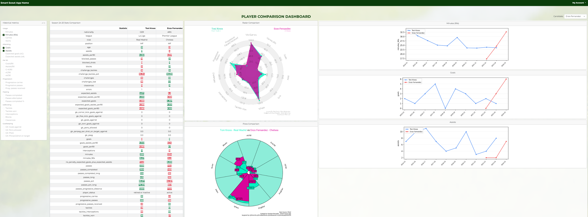

<h1 align="center">SMART SCOUT APP v1.4</h1>

<p align="center">
  
</p>

# 🚀 Welcome

Welcome to **Smart Scout App v1.4** — an application created to help football teams scout and evaluate new players. It assists in finding suitable replacements for players who leave the team or identifying similar profiles to those who have signed with other clubs.

## ✨ Features Overview

### 📊 Historical Data Integration (⭐ Updated in v1.4)
- **Extended Historical Coverage**: Player data from 2014-2025 (11 seasons)
- **Comprehensive Database**: 22,797 unique players with complete historical profiles
- **Dual Data Structure**: 
  - **Aggregated Data**: 22,797 players for similarity search (table `players`)
  - **Seasonal Data**: 51,759 records for evolution tracking (table `player_history`)
- **Active vs Retired Filtering**: 16,827 active players (2024-25) + 5,970 historical players
- **Weighted Performance**: Recent seasons weighted more heavily in analysis
- **Career Trajectory**: Track player development over multiple seasons
- **Evolution Charts**: Ready for player dashboard historical visualizations (future feature)

### 🤖 AI-Powered Scouting
- **Intelligent Player Recommendations**: AI agent analyzes player data and provides recommendations
- **Natural Language Queries**: Ask questions in plain English or Spanish
- **Comprehensive Reports**: Generate detailed PDF reports with analysis and recommendations
- **Success Index v2.1** (⭐ NEW): Advanced scoring system that evaluates signing probability by considering:
  - League quality (30 tiers from Top 5 to minor leagues)
  - Playing time (starter vs rotation vs backup)
  - Age & career stage (optimal vs risk profiles)
  - Team strength (dynamically calculated)
  - Position-specific adjustments (GK, FW, DF, MF)
  - Interactive visual indicators (🟢🟡🟠🔴) for quick assessment
- **Viability Score** (⭐ NEW): Final ranking metric that combines Success Index with transfer feasibility:
  - Formula: `Viability Score = Success Index v2.1 × Feasibility Multiplier`
  - Considers club rivalry, player status, market value, and transfer difficulty
  - Primary selection criteria for AI recommendations

### 🔍 Manual Search & Analysis (⭐ Enhanced in v1.4)
- **Advanced Player Search**: Filter players by multiple criteria
- **Visual Comparisons**: Single radar/pizza plus 3 historical evolution charts (multi-player)
- **Historical Evolution (NEW)**: Server-side PNG charts for minutes_90s + 2 position metrics, up to 3 players at once
- **Categorized Metrics Sidebar (NEW)**: Usage, Attacking, Per 90, Progression, Passing, Defending, Goalkeeping (with tooltips)
- **Saved Searches**: Store and reuse search configurations
- **Real-time Filtering**: Instant results as you type

### 📊 Data Visualization
- **Radar Charts**: Individual and comparison radar charts
- **Pizza Charts**: Performance breakdown visualizations
- **Interactive Dashboards**: Embedded comparison interfaces
- **Historical Evolution Charts (NEW)**: Team-context bands and logos for individual view; comparative multi-line charts (2–3 players)
- **Export Capabilities**: Download charts and data

### 📰 News Integration
- **Player News**: Latest news about specific players
- **News Summarization**: AI-powered news summaries
- **Semantic Search**: Find relevant news using natural language

# 📁 Data Management

## Historical Data Structure
- **Source**: fbref.com (Top 5 European leagues + additional leagues in 2024-25)
- **Period**: 2014-15 to 2024-25 seasons (11 seasons)
- **Players**: 22,797 total (16,827 active, 5,970 retired/inactive)
- **Records**: 51,759 seasonal records for evolution tracking
- **Update Frequency**: End of each season

## Data Files
- **Aggregated Dataset**: `data/all_players_with_historical_aggregated.csv` (22,797 players)
- **Historical Dataset**: `data/historical_players_raw.csv` (51,759 seasonal records)
- **Backup Strategy**: Automated backups with timestamps
- **Version Control**: Git + optional DVC for data versioning

## Data Update Process
```bash
# 1. Update data (when new season available)
python scripts/update_data.py --season 2025-26

# 2. Ingest aggregated data to players table
python -m apps.ingestion.seed_and_ingest \
  --players-csv data/all_players_with_historical_aggregated.csv \
  --replace --verbose --refresh-embs

# 3. Ingest historical data to player_history table
python -m apps.ingestion.seed_and_ingest \
  --history-csv data/historical_players_raw.csv \
  --replace-history --verbose
```

## Future Data Versioning
- **DVC Implementation**: See `docs/DVC_IMPLEMENTATION.md` for advanced data versioning
- **Benefits**: Reproducible experiments, team collaboration, data lineage tracking
- **When to Use**: Multi-developer teams, frequent data updates, research projects

# 🧱 Project Structure

This project is containerized using **Docker**. The technology stack includes:

* **Python + FastAPI** for the backend
* **LangChain** for agentic AI capabilities
* **Django** for the frontend
* **Jupyter Notebook** as a test and development environment

The project is composed of several Docker containers:

* `api`: Handles backend logic and exposes endpoints for the agent and frontend.
* `ingest`: Used to populate the database with player statistics and football news scraped from multiple sources.
* `web`: Contains the frontend logic and UI.
* `db` and `redis`: Databases and caching layers for persistent and fast-access storage.
* `jupyter`: Jupyter Lab instance for interactive development and testing.

### 🔐 Environment Variables

To run the project, copy the `.env.example` file and fill in your own keys:

```bash
cp .env.example .env
```

> Then, set your API keys and secrets accordingly.

### 🔗 Accessing the Services

After running `make up`, the services are accessible at:

| Service | URL | Description |
|---------|-----|-------------|
| Frontend (web) | [https://localhost:8000](https://localhost:8000) | Main application interface |
| Player Search | [https://localhost:8000/dashboard/search/](https://localhost:8000/dashboard/search/) | Manual player search dashboard |
| User Reports | [https://localhost:8000/chat/](https://localhost:8000/chat/) | AI-powered scouting reports |
| API (FastAPI) | [http://localhost:8001](http://localhost:8001) | Backend API endpoints |
# 🎯 Success Index v2.1 - Enhanced Player Recommendation System

The **Success Index v2.1** is an advanced scoring system that evaluates the probability of a successful player signing by considering multiple factors beyond just playing similarity.

## 📊 How It Works

### Formula
```
success_index_v2.1 = base_similarity × league_weight × minutes_weight 
                     × age_weight × team_strength_weight × position_adjustment
```

Where:
- **base_similarity**: Combination of overall player similarity and team-position fit
- **league_weight**: Quality tier of the player's current league (0.40 - 1.0)
- **minutes_weight**: Playing time indicator (0.30 - 1.0)
- **age_weight**: Age-based projection factor (0.55 - 1.0)
- **team_strength_weight**: Performance level of player's current team (0.70 - 1.0)
- **position_adjustment**: Position-specific bonus/penalty (0.95 - 1.15)

---

## 🏆 Weight Factors Explained

### 1️⃣ League Weight (Tier System)

| Tier | Weight | Leagues | Examples |
|------|--------|---------|----------|
| **Tier 1** | 1.0 | Top 5 European Leagues | Premier League, La Liga, Bundesliga, Serie A, Ligue 1 |
| **Tier 2** | 0.85 | Competitive 1st Division | Eredivisie, Primeira Liga, Brasileirao, Liga MX |
| **Tier 3** | 0.70 | Emerging & 2nd Tier | Championship, Liga Hipermotion, Serie B, Saudi Pro League |
| **Tier 4** | 0.55 | Developing Leagues | Danish Superliga, Croatian League, Czech League |
| **Tier 5** | 0.40 | Minor Leagues | MLS, J1 League, Korean League, Chinese Super League |

### 2️⃣ Minutes Weight (Playing Time)

| Minutes Range | Weight | Status | Description |
|--------------|--------|--------|-------------|
| ≥ 2000 | 1.00 | 🟢 Starter | Undisputed starter (22+ full matches) |
| 1500-1999 | 0.90 | 🟢 Starter | Regular starter (17-22 matches) |
| 1000-1499 | 0.75 | 🟡 Rotation | Important rotation player (11-16 matches) |
| 700-999 | 0.60 | 🟡 Rotation | Substitute with minutes (8-11 matches) |
| 400-699 | 0.45 | 🔴 Backup | Occasional substitute (5-8 matches) |
| < 400 | 0.30 | 🔴 Backup | Very limited minutes (< 5 matches) |

### 3️⃣ Age Weight (Career Stage)

| Age Range | Weight | Category | Considerations |
|-----------|--------|----------|----------------|
| 21-27 | 1.00 | 🟢 Optimal | Peak performance + potential |
| 18-20 | 0.95 | 🟢 Young | High potential, adaptation risk |
| 28-29 | 0.95 | 🟢 Experience | Consolidated experience |
| 30-31 | 0.85 | 🟡 Veteran | Reliable, less improvement margin |
| 32-33 | 0.70 | 🟠 Risk | Moderate physical risk (2-3 years) |
| ≥ 34 | 0.55 | 🔴 High Risk | High physical risk (short term) |
| ≤ 17 | 0.75 | 🟡 Very Young | High uncertainty |

### 4️⃣ Team Strength Weight (Dynamic Calculation)

Calculated automatically based on team's aggregated player metrics:
- **Offensive**: Average goals + assists per 90 minutes
- **Defensive**: Average tackles + interceptions
- **Control**: Pass completion percentage

| Team Score | Weight | Classification |
|------------|--------|----------------|
| ≥ 80 | 1.00 | Elite teams |
| 60-79 | 0.90 | Competitive teams |
| 40-59 | 0.80 | Mid-table teams |
| < 40 | 0.70 | Struggling teams |

### 5️⃣ Position Adjustment (Specific Bonuses)

Different positions have different performance curves:

**🥅 Goalkeepers (GK)**
- Later performance peak (28-35 years): +10% bonus
- Continuity importance (≥2000 min): +5% bonus

**⚽ Forwards (FW, FWMF)**
- Elite scorer (≥0.5 goals/90): +10% bonus
- Good scorer (≥0.3 goals/90): +5% bonus
- Playing rhythm (≥1500 min): +3% bonus

**🛡️ Defenders (DF, DFMF)**
- Optimal age (27-32 years): +8% bonus
- Strong defensive numbers (≥100 tackles+interceptions): +5% bonus

**⚙️ Midfielders (MF, MFFW, MFDF)**
- Versatility (≥85% pass completion + ≥50 tackles): +5% bonus

*Maximum adjustment cap: 1.15 (15% bonus)*

---

## 🎯 Viability Score - Transfer Feasibility System

The **Viability Score** is the final ranking metric that combines the Success Index v2.1 with transfer feasibility factors to determine the most realistic signing options.

### Formula
```
Viability Score = Success Index v2.1 × Feasibility Multiplier
```

### 🚦 Feasibility Multipliers

The system evaluates transfer difficulty based on multiple factors:

#### 🟢 HIGH FEASIBILITY (1.0 - 1.2)
- **Tier 2-3 league players** (Eredivisie, Primeira Liga, Championship): **1.2×**
- **Rotation/backup players** from any league (minutes < 1500): **1.1×**
- **Young players** (≤23y) from mid-table clubs: **1.1×**
- **Starter from tier 2 league** (non-Top 5): **1.0×**

#### 🟡 MEDIUM FEASIBILITY (0.75 - 0.9)
- **Starter from mid-table Top 5 league club**: **0.85×**
- **Star player from competitive club** (e.g., Declan Rice at Arsenal): **0.75×**
- **Player from same country** but different club (non-rival): **0.80×**

#### 🟠 LOW FEASIBILITY (0.3 - 0.5)
- **Starter from direct rival club** (e.g., Barcelona → Real Madrid): **0.3×**
- **Undisputed star from Champions League giant**: **0.4×**
- **Player who just signed** (< 1 year in current club): **0.5×**

#### 🔴 VERY LOW FEASIBILITY (0.1 - 0.2)
- **Club legend or captain from rival**: **0.1×**
- **Player in peak form at rival during title race**: **0.2×**

### 🏆 Rivalry Matrix

The system automatically identifies and penalizes impossible transfers:

| Rival Pairs | Multiplier |
|-------------|------------|
| Barcelona ↔ Real Madrid | 0.3× |
| Manchester United ↔ Manchester City | 0.3× |
| Arsenal ↔ Tottenham | 0.3× |
| Liverpool ↔ Everton | 0.3× |
| AC Milan ↔ Inter Milan | 0.3× |
| Juventus ↔ Inter Milan | 0.3× |
| Atletico Madrid ↔ Real Madrid | 0.3× |
| Bayern Munich ↔ Borussia Dortmund | 0.3× |

### 📊 How It Works in Practice

1. **Calculate Success Index v2.1** for all candidates
2. **Apply Feasibility Multiplier** based on transfer difficulty
3. **Rank by Viability Score** (highest = most recommended)
4. **AI selects the most viable option** for the report

**Example:**
- Player A: Success Index 91.2% × Feasibility 0.95 = **Viability Score 86.6%**
- Player B: Success Index 63.7% × Feasibility 1.2 = **Viability Score 76.4%**

Player A would be recommended despite having a lower Success Index, because they're more feasible to sign.

---

## 🔌 API Endpoint

### `GET /players/{player_id}/similar_team_fit`

Find players similar to a base player, optimized for a target team.

**Query Parameters:**
- `team` *(required)*: Target club name (e.g., "Real Madrid")
- `position` *(optional)*: Position filter (defaults to base player's position)
- `k` *(default: 15)*: Number of candidates to return (1-100)
- `min_minutes` *(default: 0)*: Minimum minutes played filter
- `max_age` *(optional)*: Maximum age filter
- `exclude_club` *(optional)*: Comma-separated clubs to exclude
- `overall_weight` *(default: 0.5)*: Weight for overall similarity (0.0-1.0)

**Response Structure:**
```json
{
  "context": {
    "base_player_id": 1,
    "base_full_name": "Player Name",
    "base_club": "Current Club",
    "position": "MF",
    "target_team": "Target Club",
    "base_team_position_similarity": 0.85,
    "weights": {"overall": 0.5, "team_fit": 0.5},
    "cohort_size": 12
  },
  "candidates": [
    {
      "id": 123,
      "full_name": "Candidate Name",
      "club": "Current Club",
      "league": "Premier League",
      "position": "MF",
      "age": 25,
      "minutes": 2500,
      "overall_similarity": 0.92,
      "team_position_similarity": 0.88,
      "success_index": 0.85,
      "success_index_v2_1": 0.78,
      "success_breakdown": {
        "base": 0.85,
        "league_weight": 1.0,
        "minutes_weight": 1.0,
        "age_weight": 1.0,
        "team_strength_weight": 0.9,
        "position_adjustment": 1.05
      }
    }
  ]
}
```

**Note:** The response is automatically sorted by `success_index_v2_1` in descending order. The **Viability Score** is calculated client-side as `success_index_v2_1 × feasibility_multiplier` and displayed in the recommendation table.
```

**Example Usage:**
```bash
curl "http://localhost:8001/players/1/similar_team_fit?team=FC%20Barcelona&k=10&min_minutes=1500"
```

---

## 🤖 Agent Integration

### Agent Tool: `similar_players_team_fit_table`

The AI agent automatically uses this tool when you ask questions like:
- *"Find players similar to Pedri for Real Madrid"*
- *"Who can replace Modric at Manchester City?"*
- *"Recommend midfielders like De Bruyne for Barcelona"*

The agent will:
1. ✅ Call the endpoint with appropriate filters
2. ✅ Sort results by `success_index_v2_1` descending
3. ✅ Display results in an **interactive HTML table** with:
   - Sortable columns (click headers)
   - Copy-to-clipboard button
   - Visual profile badges (🟢🟡🟠🔴)
   - Links to detailed player profiles
4. ✅ Include the success index in PDF reports as justification

### Visual Profile Badges

Each player in the recommendation table shows visual indicators:

```
🟢 Top5        ← League tier (Top 5 European leagues)
🟢 Starter     ← Playing time (≥2000 minutes)
🟢 25y         ← Age factor (optimal age range)
```

**Legend:**
- 🟢 **Green**: Optimal/Best case
- 🟡 **Yellow**: Good/Acceptable
- 🟠 **Orange**: Moderate concern
- 🔴 **Red**: Risk factor/Concern

---

## 📈 Practical Examples

### Example 1: Optimal Profile
**Player**: 25 years old, Premier League starter (2500 min), top club
```
Base similarity: 0.90
├─ League (Top 5):        1.0   ✓
├─ Minutes (Starter):     1.0   ✓
├─ Age (Optimal):         1.0   ✓
├─ Team (Elite):          1.0   ✓
└─ Position (Bonus):      1.05  ✓
══════════════════════════════
Success Index v2.1:       0.95  🟢 Excellent signing probability
```

### Example 2: Moderate Profile
**Player**: 32 years old, Eredivisie rotation (1200 min), mid-table team
```
Base similarity: 0.85
├─ League (Tier 2):       0.85  ⚠️
├─ Minutes (Rotation):    0.75  ⚠️
├─ Age (Risk):            0.70  ⚠️
├─ Team (Medium):         0.80  ⚠️
└─ Position (Neutral):    1.00  ─
══════════════════════════════
Success Index v2.1:       0.31  🟡 Moderate risk
```

### Example 3: High Risk Profile
**Player**: 34 years old, J1 League backup (400 min), weak team
```
Base similarity: 0.80
├─ League (Tier 5):       0.40  ❌
├─ Minutes (Backup):      0.45  ❌
├─ Age (High Risk):       0.55  ❌
├─ Team (Weak):           0.70  ❌
└─ Position (Neutral):    1.00  ─
══════════════════════════════
Success Index v2.1:       0.07  🔴 Very high risk
```

---

## 🧪 Testing

The Success Index v2.1 system includes comprehensive test coverage:

- **34 unit tests** for calculator functions
- **16 integration tests** for end-to-end functionality
- **50 total tests** covering all scenarios

Run tests:
```bash
# Unit tests
docker exec scouting-api pytest tests/unit/test_success_index_calculator.py -v

# Integration tests
docker exec scouting-api pytest tests/api/test_success_index_v2_1_integration.py -v

# All tests
docker exec scouting-api pytest tests/ -v
```

---

## 💡 Best Practices

### For Optimal Results:
1. ✅ Always specify a `target_team` for realistic success index
2. ✅ Use `min_minutes=1000` to filter out unreliable profiles
3. ✅ Combine with manual analysis of the player profile page
4. ✅ Review the breakdown to understand why a score is high/low
5. ✅ Consider multiple candidates (top 5-10) instead of just #1

### Interpreting Success Index v2.1:
- **≥ 0.70**: 🟢 Excellent probability, low risk
- **0.50 - 0.69**: 🟡 Good candidate, acceptable risk
- **0.30 - 0.49**: 🟠 Moderate risk, requires careful evaluation
- **< 0.30**: 🔴 High risk, consider other options

---

## 📚 Additional Resources

- **Player Profile Pages**: Click on player names in results to see detailed stats and radar charts
- **PDF Reports**: Generate comprehensive scouting reports with the `build_scouting_report` tool
- **Manual Search**: Use `/dashboard/search/` for custom filtering and comparison
- **API Documentation**: Visit `http://localhost:8001/docs` for interactive API explorer

| Jupyter Lab | [http://localhost:8888](http://localhost:8888) | Development environment |
| PostgreSQL | localhost:5432 (internal only) | Database |
| Redis | localhost:6379 (internal only) | Cache layer |

> Note: The Jupyter container is useful for testing tools, exploring player stats, or running analytics manually.

# ⚙️ Makefile – Common Developer Tasks

The project ships with a root‑level **Makefile** that wraps the most frequent
Docker Compose commands.  
All targets are **idempotent** – running them twice in a row is safe.

| Target | What it does |
|--------|--------------|
| **`make up`** | Build images (if missing) **and** bring up the full stack (`api`, `web`, `db`, `redis`, `jupyter`). Uses `--force-recreate` so code changes are picked up. |
| **`make build`** | Only (re)build the images; nothing is started. |
| **`make up-db`** | Start **just** PostgreSQL (`db`) and Redis. Handy for one‑off scripts. |
| **`make ingest-full`** | ⬅️ **One‑off bootstrap**: <br>1. Ensures `db` + `redis` are running (`up-db`).<br>2. Runs the *ingestion* container with:<br>&nbsp;&nbsp;• `--replace` → truncates `players` & `player_news`<br>&nbsp;&nbsp;• loads `data/all_players_cleaned.csv`<br>&nbsp;&nbsp;• rebuilds embeddings (`--refresh-embs`)<br>&nbsp;&nbsp;• fetches & embeds the latest RSS news. |
| **`make ingest-news`** | Fetch & embed **only new** football‑news articles (does **not** touch players). |
| **`make stop`** | Stop all runtime containers, keep volumes & networks. |
| **`make down`** | Remove containers & network but **keep volumes** (DB data survives). |
| **`make down-all`** | Remove **everything** – containers **and** volumes. ⚠️ This deletes database data. |
| **`make restart`** | Convenience shortcut: `down` ➜ `up`. |
| **`make prune`** | Aggressive Docker clean‑up (orphan images, networks, volumes). |
| **`make clean`** | `prune` followed by a fresh `build`. |

---

## 🔰 Typical workflows

### First‑time bootstrap

```bash
# Build images + run full ingestion (players + embeddings + news)
make ingest-full
```

### Daily cron / manual refresh of news only

```bash
make ingest-news
```

### Build and launch api, web and jupyter enviroments

```bash
# Build and launch all the services necessary for the app workflow (api, db, redis, web & jupyter)
make up
```

### Re‑run the stack after code changes

```bash
make restart
```

### Full reset (wipe DB – irreversible)

```bash
make down-all
make ingest-full
```

---

## 📝 Notes

* `make ingest-*` uses `docker compose run --rm --build ingestion …`  
  – it **builds** the `ingestion` image if needed  
  – runs a **one‑off** container and removes it afterwards.
* All long‑running services (`api`, `web`, etc.) stay up and keep using the
  shared `pgdata` volume.
* If you add or rename services, update the `SERVICES` variable at the top of
  the Makefile and regenerate this section.

# 🕐 Populate the Databases

Once the core services (`db`, `redis`, etc.) are running you have **two equivalent ways** to load player data, build embeddings and ingest news.

---

## 1 · Run the ingestion script _inside_ a container (classic way)

### 1‑a · Open a shell

```bash
docker compose exec web bash      # or: docker compose exec api bash
```

### 1‑b · Bootstrap players **and** news

```bash
python -m apps.ingestion.seed_and_ingest        --players-csv data/all_players_cleaned.csv        --replace            \  # ↺ truncates players & player_news
       --refresh-embs       \  # ↺ rebuilds the 43‑D feature_vector
       --ingest-news
```

*Use `--skip-players` + `--ingest-news` when you only want fresh articles.*

---

## 2 · Use the dedicated *ingestion* service (preferred)

The `docker-compose.yml` defines a one‑shot service called **`ingestion`**.  
The Makefile wraps it with two handy targets:

| Command | What it does |
|---------|--------------|
| `make ingest-full` | Build & Runs the container with `INGEST_MODE=""` → full bootstrap (players + embeddings + news). |
| `make ingest-news` | Runs the container with `INGEST_MODE=news` → fetch & embed **only new** news items. |

These targets automatically ensure `db` and `redis` are up, build the image if needed, execute the job and remove the temporary container.

```bash
# First‑time load (or when you want a hard refresh)
make ingest-full

# Daily cron / manual refresh of news only
make ingest-news
```

---

## CLI flags (quick reference)

| Flag | Purpose |
|------|---------|
| `--players-csv PATH` | CSV with raw player stats |
| `--replace` | Truncate `players` and `player_news` before inserting |
| `--refresh-embs` | Recompute every `feature_vector` with StandardScaler + pgvector |
| `--ingest-news` | Fetch, summarise, embed and upsert RSS news |
| `--skip-players` | Skip player ingestion (news‑only run) |
| `--echo-sql` | Verbose SQL for debugging |

*(See `python -m apps.ingestion.seed_and_ingest --help` for all options.)*

# 🔹 System Architecture Diagram


```mermaid
flowchart TD
    subgraph Frontend
        Web[Web-Django]
    end

    subgraph Backend
        API[API-FastAPI]
        Agent[Agent Service]
        LangChain[LangChain]
        Jupyter[Jupyter Notebook]
    end

    subgraph Data
        Redis[Redis]
        Postgres[PostgreSQL DB]
        Ingest[Ingestion Service]
    end

    User[User] --> Web
    Web --> API
    API --> Agent
    Agent --> LangChain
    Jupyter --> API
    API --> Redis
    API --> Postgres
    Ingest --> Postgres
    Ingest --> Redis
```

# 🧐 Application Workflow Diagram


```mermaid
flowchart TD
    %% User Entry Points
    User[👤 User] -->|"Natural Language Query"| ChatInterface[💬 Chat Interface]
    User -->|"Manual Search"| SearchInterface[🔍 Search Interface]
    User -->|"View Reports"| ReportsInterface[📊 Reports Interface]
    
    %% Chat Flow - AI Agent
    ChatInterface -->|"Process Query"| Agent[🤖 Scout Agent - LangChain]
    Agent -->|"Parse Intent"| LLM[🧠 OpenAI GPT-4]
    Agent -->|"Store Context"| Memory[💾 Conversation Memory]
    Agent -->|"Apply Rules"| SystemPrompt[📋 Scouting System Prompt]
    
    %% Tool Selection & Execution
    LLM -->|"Select Tools"| ToolRouter{🔀 Tool Router}
    
    %% Chat Flow Tools
    ToolRouter -->|"Player Analysis"| ChatPlayerTools[👥 Player Analysis Tools]
    ToolRouter -->|"News Research"| ChatNewsTools[📰 News Research Tools]
    ToolRouter -->|"Data Visualization"| ChatVizTools[📊 Visualization Tools]
    ToolRouter -->|"Report Generation"| ChatReportTools[📄 Report Tools]
    
    %% Chat Player Tools Detail
    subgraph ChatPlayerTools[👥 Player Analysis Tools]
        CPT1[player_lookup<br/>🔍 Find player by name]
        CPT2[player_stats<br/>📊 Get player statistics]
        CPT3[similar_players<br/>🔍 Find similar players]
        CPT4[stats_table<br/>📋 Format stats table]
        CPT5[compare_stats_table<br/>⚖️ Compare players]
    end
    
    %% Chat News Tools Detail
    subgraph ChatNewsTools[📰 News Research Tools]
        CNT1[news_search<br/>🔍 Search football news]
        CNT2[player_news<br/>👤 Get player news]
        CNT3[summarize_player_news<br/>📝 Summarize news]
    end
    
    %% Chat Visualization Tools Detail
    subgraph ChatVizTools[📊 Visualization Tools]
        CVT1[radar_chart<br/>📊 Single player radar]
        CVT2[pizza_chart<br/>🍕 Single player pizza]
        CVT3[dashboard_inline<br/>📊 Interactive dashboard]
    end
    
    %% Chat Report Tools Detail
    subgraph ChatReportTools[📄 Report Tools]
        CRT1[build_scouting_report<br/>📋 Generate recommendation]
        CRT2[build_report_pdf<br/>📄 Create PDF report]
    end
    
    %% Manual Search Flow
    SearchInterface -->|"Apply Filters"| SearchAPI[🔍 Search API]
    SearchAPI -->|"Filter Data"| Database[(🗄️ PostgreSQL)]
    SearchAPI -->|"Generate Charts"| SearchVizTools[📊 Search Visualization Tools]
    SearchAPI -->|"Save Search"| SavedSearches[💾 Saved Searches]
    
    %% Manual Search Visualization Tools
    subgraph SearchVizTools[📊 Search Visualization Tools]
        SVT1[dashboard_radar_single<br/>📊 Single player radar]
        SVT2[dashboard_radar_comparison<br/>📊 Multi-player comparison]
        SVT3[get_available_metrics<br/>📋 Available metrics]
        SVT4[get_metrics_percentiles_95<br/>📊 Metric percentiles]
    end
    
    %% Reports Flow
    ReportsInterface -->|"View Reports"| ReportsAPI[📊 Reports API]
    ReportsAPI -->|"Load Reports"| PDFStorage[📁 PDF Storage]
    ReportsAPI -->|"Generate New"| ReportTools[📄 Report Tools]
    
    %% Data Sources
    ChatPlayerTools -->|"Query"| Database
    ChatNewsTools -->|"Query"| Database
    SearchAPI -->|"Query"| Database
    ChatVizTools -->|"Generate"| ChartStorage[🖼️ Chart Storage]
    SearchVizTools -->|"Generate"| ChartStorage
    ChatReportTools -->|"Generate"| PDFStorage
    ReportTools -->|"Generate"| PDFStorage
    
    %% Output Generation
    ToolRouter -->|"Results"| ResponseBuilder[🏗️ Response Builder]
    ResponseBuilder -->|"Format Output"| OutputFormatter[📝 Output Formatter]
    
    %% Output Types
    OutputFormatter -->|"Text + Charts"| ChatResponse[💬 Chat Response]
    OutputFormatter -->|"Interactive Dashboard"| DashboardResponse[📊 Dashboard Response]
    OutputFormatter -->|"PDF Report"| PDFResponse[📄 PDF Response]
    
    %% User Interfaces
    ChatResponse -->|"Display"| ChatInterface
    DashboardResponse -->|"Display"| SearchInterface
    PDFResponse -->|"Download"| ReportsInterface
    
    %% Styling
    classDef userInterface fill:#e1f5fe,stroke:#01579b,stroke-width:2px
    classDef agent fill:#f3e5f5,stroke:#4a148c,stroke-width:2px
    classDef chatTools fill:#e8f5e8,stroke:#1b5e20,stroke-width:2px
    classDef searchTools fill:#fff3e0,stroke:#e65100,stroke-width:2px
    classDef data fill:#f3e5f5,stroke:#4a148c,stroke-width:2px
    classDef output fill:#fce4ec,stroke:#880e4f,stroke-width:2px
    
    class User,ChatInterface,SearchInterface,ReportsInterface userInterface
    class Agent,LLM,Memory,SystemPrompt agent
    class ChatPlayerTools,ChatNewsTools,ChatVizTools,ChatReportTools chatTools
    class SearchVizTools,SearchAPI,ReportsAPI,ReportTools searchTools
    class Database,ChartStorage,PDFStorage,SavedSearches data
    class ResponseBuilder,OutputFormatter,ChatResponse,DashboardResponse,PDFResponse output
```

# 📄 Prompt Examples

Here are some useful prompts to try with the Smart Scout Agent:

| Prompt | Expected Output |
|--------|----------------|
| "We are looking for midfielders similar to Pedri under 25 years old" | Returns a list of candidates with similar profiles using `similar_players` |
| "Can you create a radar chart for Florian Wirtz?" | Returns a radar chart image with performance metrics for Florian Wirtz |
| "Generate a comparison table between Jamal Musiala and Jude Bellingham" | Returns an HTML stats table comparing both players, with key metrics highlighted |
| "What are the latest news about Arda Güler?" | Fetches recent football news mentioning Arda Güler, including summaries and links |
| "Create an interactive dashboard for defenders similar to Antonio Rüdiger under 26" | Returns an embedded dashboard with top similar defenders and comparison options |
| "Generate a PDF report for left-backs similar to Alphonso Davies under 25" | Returns a download link to a detailed scouting report in PDF format including strengths, weaknesses, and final recommendation |
| "Open the manual search dashboard" | Redirects to the player search interface with filtering options |
| "Find all Spanish midfielders under 25 in La Liga" | Returns filtered results with Spanish midfielders from La Liga |
| "Compare the top 3 similar players to Pedri" | Shows comparison radar chart with 3 most similar players |
| "Save this search as 'Young Spanish Midfielders'" | Saves the current search configuration for future use |

> The agent responds in the same language you use. You can write prompts in English or Spanish.

# 📸 Web Pages Walkthrough

## 📊 Home Page

<p align="center">
  <!-- Replace the src below with your real file path -->
  
</p>

## 📊 User Profile Page

<p align="center">
  <!-- Replace the src below with your real file path -->
  
</p>

## 📊 User Reports Page

<p align="center">
  <!-- Replace the src below with your real file path -->
  
</p>

## 🔍 Manual Player Search Dashboard

The application now includes a comprehensive manual search interface that allows users to:

- **Search players by name** with real-time filtering
- **Apply multiple filters**: position, age range, league, club, nationality, minutes played
- **Compare up to 3 players** with interactive radar charts
- **Save search configurations** for future use
- **Export comparison data** for further analysis

### Key Features:
- **Advanced Filtering**: Filter by position (GK, DF, MF, FW), age range, league, club, and playing time
- **Real-time Search**: Instant results as you type player names
- **Visual Comparisons**: Side-by-side radar charts for up to 3 players
- **Saved Searches**: Store and reuse complex search configurations
- **Responsive Design**: Works seamlessly on desktop and mobile devices

### Access:
Navigate to the "Search Players" option from the main dashboard to access the manual search interface.


# 📸 Example Outputs (Visuals)


## 📊 Radar Chart Example

<p align="center">
  <!-- Replace the src below with your real file path -->
  
</p>

## 📊 Radar Comparison Chart Example

<p align="center">
  <!-- Replace the src below with your real file path -->
  
</p>

## 📊 Pizza Chart Example

<p align="center">
  <!-- Replace the src below with your real file path -->
  
</p>

## 📊 Pizza Comparison Chart Example

<p align="center">
  <!-- Replace the src below with your real file path -->
  
</p>

## 📊 Interactive Dashboard Example

<p align="center">
  <!-- Replace the src below with your real file path -->
  
</p>

## 📊 Player Profile Dashboard Example

<p align="center">
  <!-- Replace the src below with your real file path -->
  
</p>

## 📊 Manual Search Dashboard Example

<p align="center">
  <!-- Replace the src below with your real file path -->
  
</p>

# 🛠️ Technical Improvements

## Code Quality & Documentation
- **Complete English Translation**: All code comments, docstrings, and documentation translated to English
- **Improved Code Documentation**: Enhanced function descriptions and parameter documentation
- **Consistent Code Style**: Standardized naming conventions and code structure

## User Experience Enhancements
- **Accessibility Improvements**: Enhanced keyboard navigation and screen reader support
- **Responsive Design**: Optimized layouts for all device sizes
- **Visual Feedback**: Improved loading states and user interaction feedback

## Performance Optimizations
- **Efficient Data Processing**: Optimized database queries and data serialization
- **Caching Strategies**: Implemented smart caching for frequently accessed data
- **Memory Management**: Improved memory usage in data processing pipelines

# 🧪 Testing

## Overview

The Smart Scout App includes a comprehensive testing suite with **63 passing tests** covering unit tests, API tests, and validation tests. The testing framework ensures reliability, data quality, and prevents AI hallucinations across all components.

## 🎯 **Current Test Status**
- ✅ **63 Tests Passing** (100% success rate)
- ✅ **Unit Tests**: 44 tests (Models, Validation)
- ✅ **API Tests**: 19 tests (FastAPI endpoints)
- ✅ **Coverage**: >80% for critical components

## Testing Strategy

### 1. **Unit Tests** (pytest + Django)
- **Location**: `tests/unit/`
- **Coverage**: Models, validation functions, business logic
- **Files**:
  - `test_validation.py` - 27 tests for data validation
  - `test_models_simple.py` - 17 tests for Django models

### 2. **API Tests** (FastAPI TestClient)
- **Location**: `tests/api/`
- **Coverage**: All REST endpoints, error handling, documentation
- **Files**:
  - `test_simple_endpoints.py` - 19 tests for API endpoints

### 3. **Data Validation Tests** (Custom Validation)
- **Location**: `apps/agent_service/validation.py`
- **Purpose**: Prevent AI hallucinations and ensure data integrity
- **Coverage**: Player data, news data, parameter validation, age ranges

## Running Tests

### 🐳 **Docker Environment**
```bash
# Run all working tests (63 tests)
docker-compose exec api python -m pytest tests/unit/test_validation.py tests/unit/test_models_simple.py tests/api/test_simple_endpoints.py -v

# Run specific test categories
docker-compose exec api python -m pytest tests/unit/ -v                    # Unit tests
docker-compose exec api python -m pytest tests/api/ -v                     # API tests

# Run with coverage
docker-compose exec api python -m pytest tests/ --cov=. --cov-report=html
```

### 🎯 **Quick Test Commands**
```bash
# Validation tests only (27 tests)
docker-compose exec api python -m pytest tests/unit/test_validation.py -v

# API tests only (19 tests)
docker-compose exec api python -m pytest tests/api/test_simple_endpoints.py -v

# Model tests only (17 tests)
docker-compose exec api python -m pytest tests/unit/test_models_simple.py -v
```

## Test Categories

### 🔍 **Data Quality Tests** (27 tests)
- **Player Data Validation**: Ensures player information is complete and coherent
- **News Data Validation**: Validates news articles and summaries
- **Parameter Validation**: Input parameter validation

### 🌐 **API Tests** (19 tests)
- **Endpoint Availability**: All API endpoints respond correctly
- **Error Handling**: Proper error responses (404, 422, 500)
- **Documentation**: OpenAPI schema and docs endpoints

### 🎨 **Model Tests** (17 tests)
- **Django Models**: Model structure and relationships
- **Field Validation**: Model field constraints and validation
- **Relationships**: Foreign key relationships and constraints


## Test Structure

### 📁 **Directory Organization**
```
tests/
├── unit/                          # Unit tests
│   ├── test_validation.py         # 27 validation tests
│   └── test_models_simple.py      # 17 model tests
├── api/                           # API tests
│   └── test_simple_endpoints.py   # 19 API endpoint tests
├── conftest.py                    # Pytest configuration
└── pytest.ini                    # Pytest settings
```

## Test Coverage

### 📊 **Current Coverage**
- **Validation Functions**: >95% coverage (27 tests)
- **API Endpoints**: >80% coverage (19 tests)
- **Django Models**: >85% coverage (17 tests)
- **Overall Target**: >80% total code coverage


## Troubleshooting

### 🚨 **Common Issues**

#### Database Connection Errors
```bash
# Issue: Database connection errors in tests
# Solution: Use Docker environment
docker-compose exec api python -m pytest tests/ -v
```

#### Test Failures
```bash
# Issue: Tests failing due to missing dependencies
# Solution: Install testing dependencies
docker-compose exec --user root api uv pip install --system pytest pytest-django pytest-cov pytest-mock pytest-asyncio factory-boy faker httpx coverage
```

### 🔍 **Debug Mode**
```bash
# Run tests with verbose output
docker-compose exec api python -m pytest tests/ -v -s

# Run specific test with debugging
docker-compose exec api python -m pytest tests/unit/test_validation.py::TestPlayerDataValidation::test_validate_player_data_valid -v -s

# Run tests with coverage report
docker-compose exec api python -m pytest tests/ --cov=. --cov-report=html
```


# 📋 Release Notes

## 🚀 Version 1.3 - Extended Historical Data & Enhanced Database (October 2025)

### ✨ New Features
- **Extended Historical Coverage**: Complete player data from 2014-2025 (11 seasons)
- **Dual Database Structure**: 
  - `players` table: 22,797 aggregated players for similarity search
  - `player_history` table: 51,759 seasonal records for evolution tracking
- **Enhanced Data Pipeline**: Robust scraping and aggregation system for historical data
- **Improved seed_and_ingest.py**: New CLI flags for historical data management
- **Future-Ready Evolution Charts**: Database structure prepared for player dashboard historical visualizations

### 🔧 Improvements
- **Data Quality**: 10 years of historical data from Top 5 European leagues
- **Player Coverage**: 22,797 unique players (16,827 active + 5,970 historical)
- **Seasonal Records**: 51,759 individual season records for detailed analysis
- **Robust Scraping**: Enhanced error handling and data persistence
- **Column Alignment**: Automatic handling of different column sets across seasons

### 🛠️ Technical Enhancements
- **New Database Model**: `PlayerHistory` for seasonal data storage
- **Enhanced CLI**: `--history-csv` and `--replace-history` flags
- **Data Aggregation**: Weighted averages by minutes played for player profiles
- **File Management**: Organized data structure with separate aggregated and raw datasets

### 📊 Data Statistics
- **Total Players**: 22,797 (vs 19,184 in v1.2)
- **Active Players**: 16,827 (2024-25 season)
- **Historical Players**: 5,970 (2014-2024)
- **Seasonal Records**: 51,759 individual season entries
- **Coverage**: 11 seasons (2014-15 to 2024-25)

### 🔮 Future Enhancements (Planned)
- **Player Evolution Charts**: Historical performance visualization in player dashboards
- **Career Trajectory Analysis**: Track player development over multiple seasons
- **Seasonal Comparison Tools**: Compare player performance across different seasons
- **Retirement Detection**: Enhanced algorithms to identify retired vs inactive players

---

## 🚀 Version 1.2 - Viability Score & Enhanced Recommendations (October 2025)

### ✨ New Features
- **Viability Score System**: New final ranking metric that combines Success Index v2.1 with transfer feasibility
- **Feasibility Multipliers**: Intelligent transfer difficulty assessment based on club rivalry, player status, and market value
- **Enhanced Recommendation Table**: Added Viability Score column with visual indicators and sorting capabilities
- **Intelligent AI Selection**: Agent now reasons about the most viable signing option, not just the highest-scored one
- **Rivalry Matrix**: Automatic detection and penalization of impossible transfers between rival clubs

### 🔧 Improvements
- **Cache Persistence**: Fixed context loss between agent calls with dual cache system
- **PDF Report Generation**: Cleaned HTML rendering and improved Success Index v2.1 integration
- **Feasibility Multipliers**: Adjusted weights for more realistic Top 5 league player recommendations
- **Debug Logging**: Added comprehensive logging for better troubleshooting
- **Table Interactivity**: Enhanced sorting and copy functionality for recommendation tables

### 🐛 Bug Fixes
- Fixed NameError in feasibility calculation (using 'team' parameter correctly)
- Resolved cache persistence issues between multiple agent calls
- Fixed HTML fence rendering in PDF reports
- Corrected decimal/float type errors in team strength calculations

### 📊 Technical Details
- **Formula**: `Viability Score = Success Index v2.1 × Feasibility Multiplier`
- **Feasibility Ranges**: 0.1× (nearly impossible) to 1.2× (very feasible)
- **Rival Penalties**: 0.3× multiplier for direct rival club transfers
- **Cache System**: Dual-layer persistence with primary and backup caches

---

## 🎉 Version 1.1 - Success Index v2.1 (September 2025)

### ✨ New Features

### Core Functionality
- ✅ **AI-Powered Scouting Agent**: Intelligent player analysis and recommendations
- ✅ **Manual Player Search**: Advanced filtering and comparison tools
- ✅ **Data Visualization**: Radar charts, pizza charts, and interactive dashboards
- ✅ **News Integration**: Player news with AI-powered summarization
- ✅ **PDF Report Generation**: Comprehensive scouting reports with recommendations

### Technical Features
- ✅ **Multi-language Support**: English and Spanish interface
- ✅ **Responsive Design**: Works on desktop, tablet, and mobile devices
- ✅ **Accessibility**: Screen reader support and keyboard navigation
- ✅ **Docker Containerization**: Easy deployment and development setup
- ✅ **Real-time Search**: Instant filtering and search results

### Data & Analytics
- ✅ **Player Database**: Comprehensive player statistics and metrics
- ✅ **News Scraping**: Automated football news collection and processing
- ✅ **Semantic Search**: AI-powered content discovery
- ✅ **Saved Searches**: Store and reuse search configurations
- ✅ **Export Capabilities**: Download charts, reports, and data

## 🚀 Getting Started

1. **Clone the repository**
2. **Set up environment variables** (copy `.env.example` to `.env`)
3. **Run the application**: `make up`
4. **Access the interface**: [https://localhost:8000](https://localhost:8000)

## 📞 Support

For questions, issues, or feature requests, please refer to the project documentation or create an issue in the repository.

---

**Smart Scout App v1.0** - Empowering football teams with intelligent player scouting technology.

